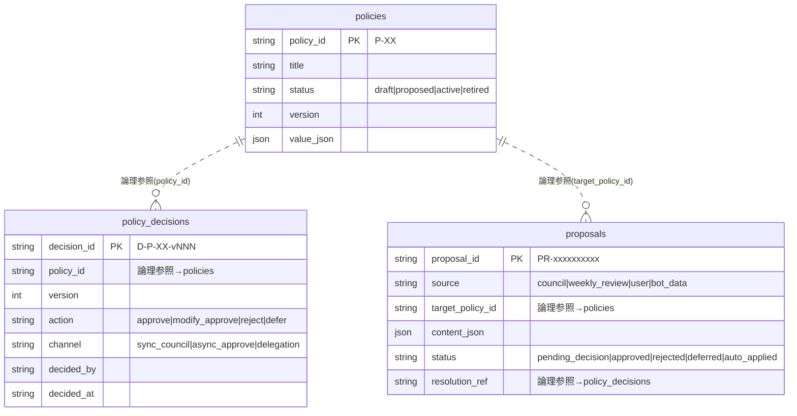
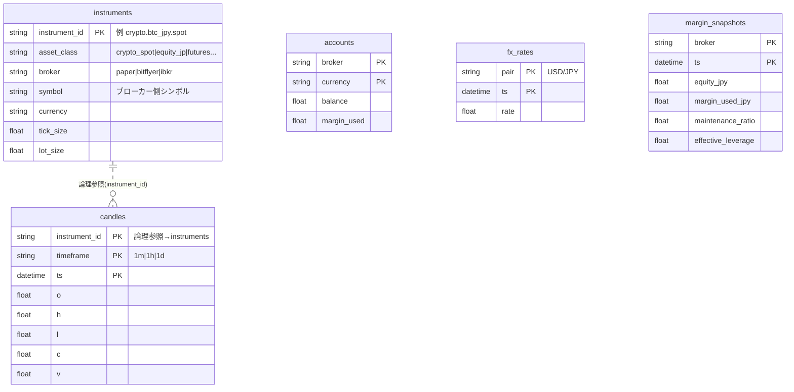
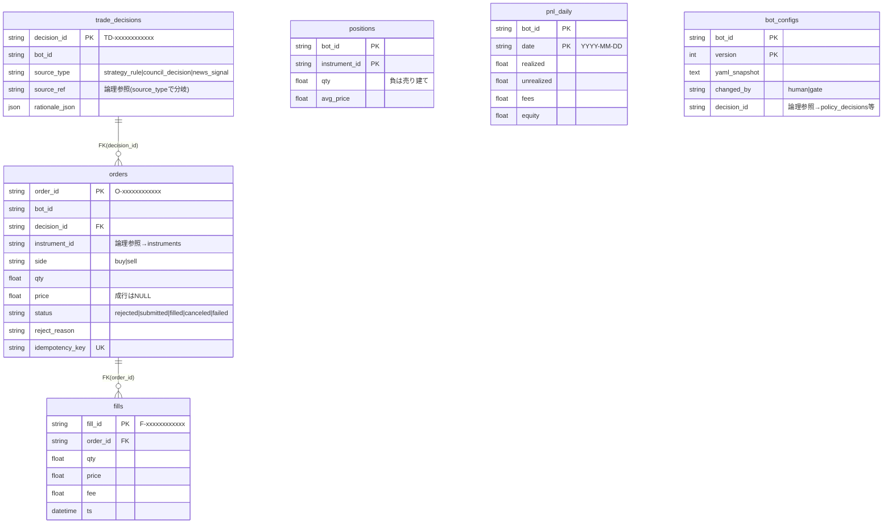
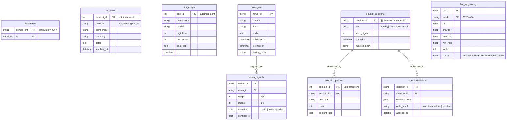
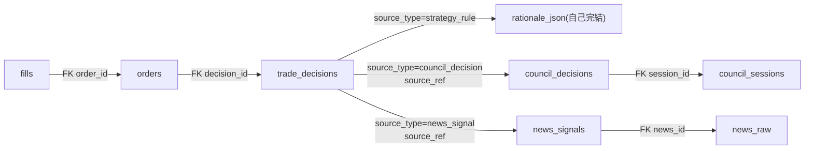

# 04 データベース設計書

| 項目 | 内容 |
|---|---|
| 日付 | 2026-06-11 |
| ステータス | 承認済み(決裁権者の計画承認による) |
| 関連 | docs/02_基本設計書.md §4(概念設計)/ ADR-0001 §5(trade_decisions)/ ADR-0002 §6(本書の新設) |
| 実装 | `core/db/models.py`(スキーマ)・`core/db/engine.py`(接続)・`core/db/init.py`(初期化) |

本書は **物理スキーマの詳細仕様**(実装準拠)である。docs/02 §4 は概念設計であり、
両者が食い違う場合は本書と `core/db/models.py` を正とする。
**`core/db/models.py` を変更したら本書を必ず併せて更新すること。**

---

## 1. 方式と選定理由

### 1.1 SQLite + WAL

| 項目 | 値 | 根拠 |
|---|---|---|
| エンジン | SQLite(ファイル: `var/tradecouncil.db`) | 1台・単一利用者・書き込み頻度は秒〜分オーダー。サーバ運用ゼロで Phase 0 の「ローカル完結」に合致 |
| journal_mode | WAL | 読み(KPI集計・status)と書き(BOT・watchdog)の並行を許す |
| synchronous | NORMAL | WAL との組み合わせで十分な耐久性と速度の折衷 |
| foreign_keys | ON | SQLite は既定 OFF のため接続毎に PRAGMA で強制(`core/db/engine.py`) |
| ORM | SQLAlchemy 2.x(`Mapped` 型注釈・DeclarativeBase) | 型安全・PostgreSQL 移行時の互換レイヤ |
| セッション | `session_scope()` コンテキストマネージャ(自動 commit/rollback) | 例外を握りつぶさない規約と整合 |

### 1.2 PostgreSQL 移行考慮(Phase 1 以降)

- **JSON カラム** → JSONB へ(SQLAlchemy の `JSON` 型はそのまま動くが、インデックスを張るなら JSONB)
- **DateTime は naive で保存される**: `utcnow()` は aware(UTC)を返すが SQLite は tzinfo を落とす。
  比較側(watchdog 等)も naive UTC 前提で書かれている。PostgreSQL では `DateTime(timezone=True)` への
  統一が必要(全カラム一括で行うこと。混在は事故のもと)
- **String 長は全カラム指定済み** → そのまま `VARCHAR(n)` に移行可能
- **autoincrement PK**(incidents.incident_id / llm_usage.call_id / council_opinions.opinion_id)→ IDENTITY に対応

---

## 2. ER図

凡例: 実線 = 物理 FK(5本のみ)。「論理参照」と注記した関係は FK 制約のない参照
(アプリケーション層で整合を保証。`scripts.cli kpi` の根拠連鎖検証が監査する)。

### 2.1 ガバナンス(§1.5)

物理 FK はなし。YAML(`config/policies/`)が真実の源泉で、DB は監査ミラー。

### 2.2 マーケット・口座(FR-8)

すべて独立テーブル(instrument_id / broker は論理キーで共有)。

### 2.3 取引根拠・執行(FR-4 / 不変条項3)

システムの背骨。物理 FK 2本(orders→trade_decisions、fills→orders)。

### 2.4 監視・ニュース・会議

---

## 3. テーブル詳細仕様(全23テーブル)

共通事項:

- **全テーブルに `created_at`**(DateTime, NOT NULL, 既定 `utcnow()`)を持つ。以下の表では省略する。
  `heartbeats` のみ `CreatedAtMixin` を使わず同等カラムを直接定義している(実装上の差異のみ、意味は同じ)
- `updated_at`(onupdate 付き)を持つのは **policies / accounts / positions** の3つ
- 「Phase 0」列: ● = Phase 0 で実際に読み書きされる(14テーブル)/ ○ = 定義のみ(Phase 1 以降)

### 3.1 ガバナンス

#### policies — ポリシー現在値ミラー(Phase 0 ●)

真実の源泉は `config/policies/*.yaml`。DB は照会・監査用ミラーで、
`core/governance/registry.py` の決裁適用時にのみ更新される(手書き禁止)。

| カラム | 型 | 制約 | 説明 |
|---|---|---|---|
| policy_id | String(16) | PK | `P-XX` 形式 |
| title | String(200) | NOT NULL | |
| status | String(16) | NOT NULL | draft / proposed / active / retired |
| version | Integer | NOT NULL | 決裁ごとに増分 |
| value_json | JSON | NOT NULL | ポリシー値(例 `{"max_daily_loss_pct": 2.0}`) |
| effective_from | String(32) | NULL可 | ISO 8601(将来日付なら予約) |
| review_after | String(32) | NULL可 | 期限到来で再上程対象 |
| updated_at | DateTime | NOT NULL, onupdate | |

読み書き: 書 = `core/governance/registry.py` / 読 = `core/risk/guard.py`(レジストリ経由)・`scripts/cli.py status`

#### policy_decisions — 決裁履歴(Phase 0 ●、append-only)

**不変条項3(全決定の監査ログ)の実体。削除・更新しない。** ロールバックは
旧バージョン値の再決裁(新しい decision_id の追加)で表現する。

| カラム | 型 | 制約 | 説明 |
|---|---|---|---|
| decision_id | String(32) | PK | `D-P-XX-vNNN` 形式 |
| policy_id | String(16) | NOT NULL(論理参照→policies) | |
| version | Integer | NOT NULL | |
| action | String(20) | NOT NULL | approve / modify_approve / reject / defer |
| channel | String(20) | NOT NULL | sync_council / async_approve / delegation |
| session_ref | String(100) | NULL可 | 例 `council-0` |
| basis_refs_json | JSON | NULL可 | 根拠資料パスの配列 |
| decided_by | String(40) | NOT NULL | Phase 0 は常に owner |
| decided_at | String(40) | NOT NULL | ISO 8601(タイムゾーン付き文字列のまま保存) |
| value_snapshot_json | JSON | NULL可 | 決裁時点の値スナップショット |

読み書き: 書 = `core/governance/registry.py`(`tc policy record` 経由のみ)/ 読 = KPI・監査

#### proposals — 決裁キュー(Phase 0 ●)

decision_gate が「委任範囲外」と判定した提案の保留先。`tc approve|reject|defer` で解決する。

| カラム | 型 | 制約 | 説明 |
|---|---|---|---|
| proposal_id | String(40) | PK | `PR-` + 10hex |
| source | String(40) | NOT NULL | council / weekly_review / user / bot_data |
| target_policy_id | String(16) | NULL可(論理参照→policies) | |
| content_json | JSON | NOT NULL | 提案内容 |
| status | String(24) | NOT NULL, 既定 pending_decision | pending_decision / approved / rejected / deferred / auto_applied |
| resolution_ref | String(40) | NULL可 | 解決した decision_id(論理参照) |

読み書き: 書 = `core/governance/decision_gate.py`・`scripts/cli.py approve 等` / 読 = `tc status`

### 3.2 マーケット・口座

#### instruments — 統一インストゥルメントモデル(Phase 0 ●)

真実の源泉は `config/instruments/*.yaml`。起動時に `core/market/instrument.py` が DB へ同期する。

| カラム | 型 | 制約 | 説明 |
|---|---|---|---|
| instrument_id | String(64) | PK | 例 `crypto.btc_jpy.spot`(`<class>.<name>.<kind>`) |
| asset_class | String(24) | NOT NULL | crypto_spot / equity_jp / futures … |
| broker | String(24) | NOT NULL | paper / bitflyer / ibkr |
| symbol | String(40) | NOT NULL | ブローカー側シンボル |
| currency | String(8) | NOT NULL | JPY / USD |
| tick_size / lot_size | Float | NOT NULL | 呼値・最小単位 |
| session_calendar | String(40) | NOT NULL | crypto_24h / jpx_futures … |
| margin_rule | String(40) | NOT NULL | usd_simple / span_like … |

#### accounts — 口座残高(Phase 0 ●)

| カラム | 型 | 制約 | 説明 |
|---|---|---|---|
| broker | String(24) | PK(複合) | |
| currency | String(8) | PK(複合) | |
| balance | Float | NOT NULL | |
| margin_used | Float | NOT NULL, 既定 0 | |
| updated_at | DateTime | onupdate | |

読み書き: 書 = ペーパーアダプタ(`core/exchange/paper_crypto.py`)/ 読 = `core/risk/guard.py`(エクスポージャ比率)

#### fx_rates — 為替レート時系列(Phase 1 ○)

| カラム | 型 | 制約 |
|---|---|---|
| pair | String(16) | PK(複合)。例 `USD/JPY` |
| ts | DateTime | PK(複合) |
| rate | Float | NOT NULL |

#### margin_snapshots — 証拠金スナップショット(Phase 1 ○)

FR-5.8〜5.10(レバレッジ・維持率監視)用。

| カラム | 型 | 制約 |
|---|---|---|
| broker | String(24) | PK(複合) |
| ts | DateTime | PK(複合) |
| equity_jpy / margin_used_jpy | Float | NOT NULL |
| maintenance_ratio | Float | NULL可(現物のみの場合) |
| effective_leverage | Float | NOT NULL |

#### candles — OHLCV 時系列(Phase 0 ●)

docs/02 §4 の旧定義では `symbol` キーだったが、マルチアセット化に伴い
`instrument_id` に正規化済み(docs/02 §4 も改訂済み)。

| カラム | 型 | 制約 |
|---|---|---|
| instrument_id | String(64) | PK(複合)。論理参照→instruments |
| timeframe | String(8) | PK(複合)。1m / 1h / 1d |
| ts | DateTime | PK(複合) |
| o / h / l / c | Float | NOT NULL |
| v | Float | NOT NULL, 既定 0 |

読み書き: 書 = `core/runner/bot_runner.py`(フィードから)/ 読 = 戦略 on_bar・`core/risk/guard.py`(サーキットブレーカ)

### 3.3 取引根拠・執行

#### trade_decisions — 全注文の根拠(Phase 0 ●、ADR-0001 §5)

**根拠連鎖の結合点。** bot_runner は risk_guard 呼び出しの**前に**必ず起票する。
これを通らない発注経路を作ってはならない(絶対ルール6)。

| カラム | 型 | 制約 | 説明 |
|---|---|---|---|
| decision_id | String(40) | PK | `TD-` + 12hex |
| bot_id | String(40) | NOT NULL | |
| source_type | String(24) | NOT NULL | strategy_rule / council_decision / news_signal |
| source_ref | String(80) | NULL可 | source_type に応じ council_decisions.decision_id / news_signals.signal_id / ルール名 |
| rationale_json | JSON | NOT NULL | 根拠の自己記述(例 `{"rule": "...", "reason": "..."}`) |

読み書き: 書 = `core/execution/decisions.py` / 読 = KPI 根拠連鎖検証

#### orders — 全発注監査ログ(Phase 0 ●)

**拒否(rejected)も記録される**(risk_guard が拒否時に書く)。「実行された注文の記録」ではなく
「発注しようとした全意図の記録」である点が監査上の要。

| カラム | 型 | 制約 | 説明 |
|---|---|---|---|
| order_id | String(40) | PK | `O-` + 12hex |
| bot_id | String(40) | NOT NULL | |
| decision_id | String(40) | **FK→trade_decisions**, NOT NULL | |
| instrument_id | String(64) | NOT NULL(論理参照→instruments) | |
| side | String(4) | NOT NULL | buy / sell |
| qty | Float | NOT NULL | |
| price | Float | NULL可 | 成行は NULL |
| order_type | String(12) | NOT NULL, 既定 market | |
| status | String(16) | NOT NULL | rejected / submitted / filled / canceled / failed |
| reject_reason | String(120) | NULL可 | RiskRejection の code+message |
| exchange_order_id | String(64) | NULL可 | ブローカー側 ID(`PB-` 等) |
| idempotency_key | String(64) | **UNIQUE**(uq_orders_idempotency)、NULL可 | 二重発注防止 |

読み書き: 書 = `core/execution/executor.py`(承認注文)・`core/risk/guard.py`(拒否)/ 読 = `feedback/kpi.py`・`tc status`

#### fills — 約定(Phase 0 ●)

1 order に対し複数 fill(部分約定)を許す。

| カラム | 型 | 制約 |
|---|---|---|
| fill_id | String(40) | PK。`F-` + 12hex |
| order_id | String(40) | **FK→orders**, NOT NULL |
| qty / price | Float | NOT NULL |
| fee | Float | NOT NULL, 既定 0 |
| ts | DateTime | NOT NULL(約定時刻) |

#### positions — 現在建玉(Phase 0 ●)

| カラム | 型 | 制約 | 説明 |
|---|---|---|---|
| bot_id | String(40) | PK(複合) | |
| instrument_id | String(64) | PK(複合) | |
| qty | Float | NOT NULL | 負値 = 売り建て |
| avg_price | Float | NOT NULL | |
| updated_at | DateTime | onupdate | |

読み書き: 書 = executor(約定反映)・reconcile(再起動時の取引所突合)/ 読 = risk_guard(建玉数上限)

#### pnl_daily — 日次損益(Phase 0 ●)

| カラム | 型 | 制約 |
|---|---|---|
| bot_id | String(40) | PK(複合) |
| date | String(10) | PK(複合)。`YYYY-MM-DD` |
| realized / unrealized / fees / equity | Float | NOT NULL, 既定 0 |

読み書き: 書 = executor / 読 = risk_guard(日次損失上限 P-03)・`feedback/kpi.py`

> **通貨の注記(ADR-0008)**: `pnl_daily` / `fills` / `orders` の金額は **instrument 通貨建て**
> で記録される(paper BOT = JPY、Bybit testnet BOT = USDT)。リスクチェック時の JPY 換算は
> bot_runner が `fx.usdjpy_rate`(保守的固定レート)で行い、DB の一次情報は加工しない。
> bot 間の通貨統合 KPI は REQ-M04(Phase 6)。それまで KPI は bot 単位で読む。

#### bot_configs — BOT設定の全履歴(Phase 0 ●)

| カラム | 型 | 制約 | 説明 |
|---|---|---|---|
| bot_id | String(40) | PK(複合) | |
| version | Integer | PK(複合) | 変更ごとに増分 |
| yaml_snapshot | Text | NOT NULL | 設定 YAML 全文 |
| changed_by | String(16) | NOT NULL | human / gate |
| decision_id | String(40) | NULL可 | 変更の根拠(論理参照) |

### 3.4 監視・運用

#### heartbeats — 死活監視(Phase 0 ●)

| カラム | 型 | 制約 |
|---|---|---|
| component | String(60) | PK(複合)。例 `bot:dummy_rw` |
| ts | DateTime | PK(複合)。merge(upsert)で打刻 |

読み書き: 書 = `core/runner/heartbeat.py` / 読 = `core/runner/watchdog.py`(途絶検知)

#### incidents — 障害・異常記録(Phase 0 ●)

例外を握りつぶさない規約の受け皿。重大インシデント 0 件(不変条項5)の根拠データ。

| カラム | 型 | 制約 |
|---|---|---|
| incident_id | Integer | PK, autoincrement |
| severity | String(12) | NOT NULL。info / warning / critical |
| component | String(60) | NOT NULL |
| summary | String(200) | NOT NULL |
| detail | Text | NULL可 |
| resolved_at | DateTime | NULL可 |

書き込み元: bot_runner(例外)・watchdog(途絶)・decision_gate(不変条項違反)

#### llm_usage — LLM コストメーター(Phase 2 ○、FR-7.3)

| カラム | 型 | 制約 |
|---|---|---|
| call_id | Integer | PK, autoincrement |
| component | String(60) | NOT NULL。news_pipeline / council_runner 等 |
| model | String(60) | NOT NULL |
| in_tokens / out_tokens | Integer | NOT NULL, 既定 0 |
| cost_est | Float | NOT NULL, 既定 0(推定円) |
| ts | DateTime | NOT NULL |

### 3.5 ニュース(Phase 2 ○)

#### news_raw — 記事原文

| カラム | 型 | 制約 |
|---|---|---|
| news_id | String(40) | PK |
| source | String(60) | NOT NULL |
| url | String(500) | NULL可 |
| title | String(300) | NOT NULL |
| body | Text | NULL可 |
| published_at | DateTime | NULL可 |
| fetched_at | DateTime | NOT NULL(published_at との差 = 検知遅延 KPI) |
| dedup_hash | String(64) | NOT NULL(重複排除) |

#### news_signals — 影響度スコア(3段フィルタの出力)

| カラム | 型 | 制約 |
|---|---|---|
| signal_id | String(40) | PK |
| news_id | String(40) | **FK→news_raw**, NOT NULL |
| stage | Integer | NOT NULL。1/2/3(どの段の判定か) |
| impact | Integer | NOT NULL。1〜5 |
| symbols_json | JSON | NULL可。関連 instrument_id の配列 |
| direction | String(12) | NULL可。bullish / bearish / unclear |
| confidence | Float | NULL可。0〜1 |
| half_life_min | Integer | NULL可。影響持続の目安 |
| model | String(60) | NULL可。判定に使った LLM |
| raw_json | JSON | NULL可。LLM 生出力 |

### 3.6 戦略会議・KPI

#### council_sessions — 会議セッション(Phase 0 は `tc council log` で記録)

| カラム | 型 | 制約 |
|---|---|---|
| session_id | String(40) | PK。例 `council-0`、`2026-W24` |
| kind | String(16) | NOT NULL。weekly / daily / adhoc / kickoff |
| input_digest | Text | NULL可(会議パッケージ要約) |
| started_at | DateTime | NOT NULL |
| minutes_path | String(300) | NULL可(議事録 Markdown のパス) |

#### council_opinions — ペルソナ別発言(Phase 3 ○)

| カラム | 型 | 制約 |
|---|---|---|
| opinion_id | Integer | PK, autoincrement |
| session_id | String(40) | **FK→council_sessions**, NOT NULL |
| persona | String(40) | NOT NULL。macro_analyst / risk_manager 等 |
| round | Integer | NOT NULL |
| content_json | JSON | NOT NULL |

#### council_decisions — 会議決議 + ゲート検証結果(Phase 3 ○)

| カラム | 型 | 制約 |
|---|---|---|
| decision_id | String(40) | PK |
| session_id | String(40) | **FK→council_sessions**, NOT NULL |
| decision_json | JSON | NOT NULL(決議 JSON スキーマ v1) |
| gate_result | String(16) | NULL可。accepted / modified / rejected |
| applied_at | DateTime | NULL可 |

#### bot_kpi_weekly — 週次KPI(FR-6)

| カラム | 型 | 制約 |
|---|---|---|
| bot_id | String(40) | PK(複合) |
| week | String(10) | PK(複合)。ISO 週 `2026-W24` |
| pf / sharpe / max_dd / win_rate / avg_r | Float | NULL可 |
| trades | Integer | NULL可 |
| status | String(12) | NULL可。ACTIVE / REDUCED / PAPER / RETIRED(悪BOT状態遷移) |

---

## 4. 根拠連鎖(トレーサビリティ)

不変条項3「全注文は根拠まで遡及可能」の実現構造:

- 経路は固定: 戦略 on_bar → **trade_decisions 起票** → risk_guard.check(唯一の関門)→
  executor.submit(RiskApprovedOrder のみ受理)→ orders / fills
- 拒否された意図も orders(status=rejected, reject_reason 付き)に残る
- **機械検証**: `python -m scripts.cli kpi` が「decision_id で trade_decisions に遡及できない
  orders(orphan)が 0 件」であることを毎回検証する。orphan > 0 は不変条項3違反 = 重大インシデント

---

## 5. マイグレーション方針

### 5.1 現状(Phase 0)

- 初期化は `python -m scripts.cli db init` → `Base.metadata.create_all()`
- `create_all()` は**存在しないテーブルの新規作成のみ**冪等に行う。
  **既存テーブルへのカラム追加・型変更・制約変更は反映されない**(SQLite/SQLAlchemy の仕様)

### 5.2 Phase 0 でのスキーマ変更手順

1. `core/db/models.py` を変更し、**本書(docs/04)を併せて更新**する
2. 変更が**テーブル追加のみ**の場合: `tc db init` の再実行で完了(既存データ無傷)
3. 変更が**既存テーブルのカラム追加等**の場合:
   - DB に **policy_decisions / orders 等の監査データが入っているなら**、手動 `ALTER TABLE`
     (または dump → 再作成 → restore)で移行する。**監査データの破棄は不変条項3違反**であり不可
   - paper の試運転データしか入っていないなら、`var/tradecouncil.db` を削除して再生成してよい
     (削除前に `tc kpi` で監査対象データがないことを確認)
4. `python -m scripts.cli test` が緑になるまで完了としない

### 5.3 Phase 1 以降

- スキーマ変更が定常化する段階で **Alembic を導入**する(BACKLOG: BL-010。着手前に ADR 起票)
- PostgreSQL 移行時は §1.2 の考慮点(JSONB / timezone-aware DateTime)を同一マイグレーションで処理する

---

## 6. 命名規約・ID形式

### 6.1 テーブル・カラム

- テーブル名: snake_case・複数形(`orders`, `policy_decisions`)
- 主キーは `<entity>_id`。時系列は複合 PK(`(キー, ts)`)で重複挿入を構造的に防ぐ
- JSON カラムは `_json` サフィックス

### 6.2 ID 形式一覧

| プレフィックス | 形式 | 対象 | 採番箇所 |
|---|---|---|---|
| `TD-` | TD-{12hex} | trade_decisions.decision_id | `core/execution/decisions.py` |
| `O-` | O-{12hex} | orders.order_id | `core/execution/executor.py`・`core/risk/guard.py`(拒否) |
| `F-` | F-{12hex} | fills.fill_id | `core/execution/executor.py` |
| `PR-` | PR-{10hex} | proposals.proposal_id | `core/governance/decision_gate.py` |
| `PB-` | PB-{hex} | exchange_order_id(ペーパー) | `core/exchange/paper_crypto.py` |
| `D-P-XX-vNNN` | 例 D-P-03-v002 | policy_decisions.decision_id | 決裁レコード YAML(scenarios/council.md 準拠) |
| `P-XX` | 例 P-03 | policies.policy_id | docs/03 のポリシー台帳 |
| (週番号) | ISO 形式 2026-W24 | bot_kpi_weekly.week / council_sessions.session_id | `feedback/kpi.py` |
