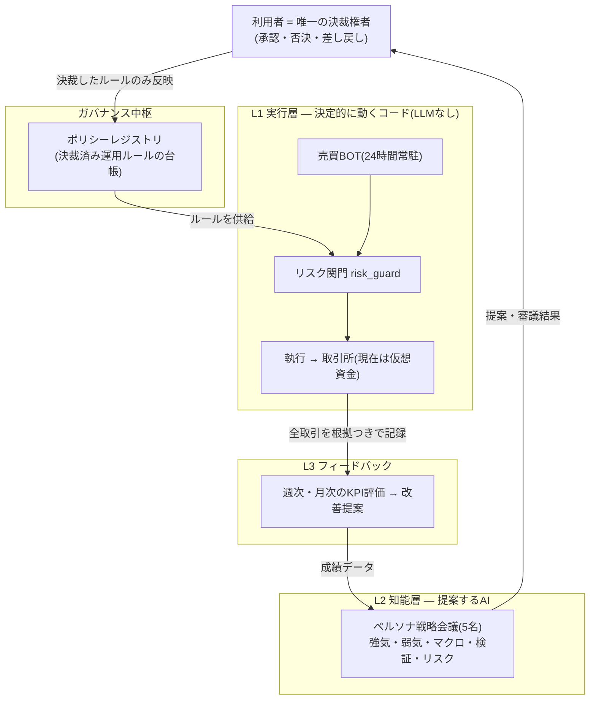
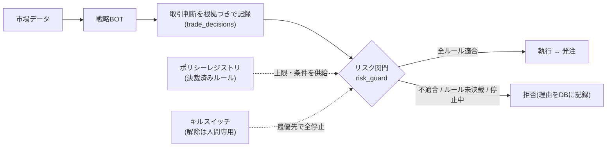
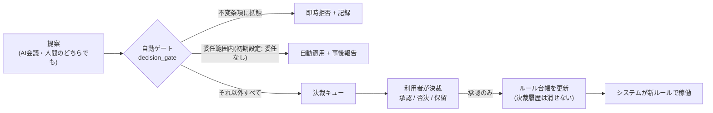
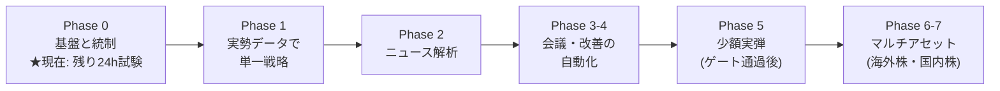

# TradeCouncil — エグゼクティブ向けシステム概要

| 項目 | 内容 |
|---|---|
| 対象読者 | 経営層・意思決定者(技術的な前提知識は不要) |
| 作成日 | 2026-06-12 |
| 位置づけ | 一次資料(docs/01〜05)の要約。判断の根拠・詳細は一次資料を参照 |
| 分量 | A4 3枚(図4点) |

---

## 1枚目: TradeCouncil とは — 「AIに働かせても、決定権は人が握る」

**一言で**: 複数のAIエージェント(売買BOT・分析ペルソナ)が24時間「情報収集 → 分析 → 売買 → 記録」を回し続け、**運用ルールの決定権だけは利用者(人間)が独占する**、ガバナンス内蔵型の自動売買フレームワーク。

### なぜ「ガバナンス」が主役なのか

AI活用の自動売買で最大のリスクは、損失そのものより**暴走・逸脱・説明不能**である。
本プロジェクトの一次成果物は個別の取引ルールではなく、**「決裁を経ない変更が構造的に不可能」な統制基盤**であり、その上で運用ルール(レバレッジ・損失上限など)を「AI会議 + 利用者の決裁」で継続的に育てていく。

- **やらないこと(非ゴール)**: ミリ秒単位の高頻度取引 / 利益の保証 / AIによる注文の直接執行 / 初日からの完全自動運用
- **やること**: 期待値を検証できる仕組みと、監査に耐える記録を備えた無人運用パイプラインの構築

### 3つの設計原則(システムの「憲法」)

1. **人間が唯一の決裁権者** — AIエージェントの権限は「提案・審議」まで
2. **LLM非執行** — AIの出力が検証なしに発注へ到達する経路がそもそも存在しない
3. **No Policy, No Trade(fail-closed)** — 決裁済みルールが無い領域では、取引自体を拒否する

### 図1: 全体像 — 三層構造と統制の流れ

ポイントは矢印の向き: **AIの提案は必ず利用者を経由してしかルールにならず、実行層はそのルールしか読まない**。AIから実行層への直通線は存在しない。

---

## 2枚目: 安全をどう担保するか — 多層の統制

### 不変条項 — 会議の議題にすらできない5箇条

①決裁権は利用者のみ ②LLM非執行 ③全決定の監査ログ ④キルスイッチ ⑤fail-closed。
これらの変更・緩和を求める提案は、AI会議で全員が賛成しても**システムが自動的に拒否し、事故として記録**する。

### 図2: 発注の「一本道」— これ以外の経路は存在しない

- すべての注文は記録済みの「判断」に紐づき(decision_id)、**「なぜこの取引をしたのか」へ後から必ず遡れる**
- 経路の健全性(BOTが関門を迂回できないこと)は自動テストで恒常的に検査。リスク部はテスト網羅率90%を下回るとリリース不可

### 図3: ルールはどう変わるか — 提案は自由、反映は決裁のみ

### 会議体 — わざと「偏った」5人のAIに議論させる

戦略会議は、強気のトレーダー、弱気の逆張り派、中期マクロ分析、データ検証担当、そして**損失回避だけを使命とし唯一の拒否権(veto)を持つリスク管理者**の5ペルソナで構成。意図的に対立する視点を設計することで、一方向に流れる「AIの全会一致」を防ぎ、反対意見・少数意見も議事録に残す。

---

## 3枚目: 現在地・計画・経営目線の要点

### 数字で見る現在地(2026-06-12 時点)

| 指標 | 現在値 |
|---|---|
| 決裁済み運用規程 | **5件 active**(決裁・委任 / レバレッジ / 口座リスク上限 / セーフガード / 悪BOT淘汰)— 第0回意思決定会議(2026-06-12)で決裁 |
| 自動テスト | **150件 全合格**(リスク部は網羅率90%を強制) |
| 稼働モード | **仮想資金(paper)のみ** — 実弾発注の機能はコード上に存在しない |
| AIの執行権限 | **0**(提案・審議まで) |
| 残タスク(Phase 0 完了条件) | ペーパーBOT 1体の**24時間無人稼働試験** |

### 図4: ロードマップ — 実弾は5段階先、各段階にゲート

実弾移行(Phase 5)は自動では起きない。**仮想資金での実績がゲート基準を満たし、かつ利用者が別途決裁した場合のみ**、少額(数万円規模)から段階的に開始する。

### コスト統制

インフラは AWS 最小構成(サーバ1台)で確定済み。**月額コスト上限(目安1万円・仮置き)**を設け、LLM API 費用が上限に迫った場合は知能層の呼び出しを自動縮退する。通知・承認の動線は Microsoft Teams に集約。

### 主なリスクと統制の対応

| 想定リスク | 統制 |
|---|---|
| AIの暴走・逸脱 | LLM非執行 + 発注一本道 + 不変条項(図1〜3) |
| 相場急変 | 価格急変・スプレッド異常時の自動取引停止(セーフガード規程)+ キルスイッチ |
| 不振戦略の放置 | 週次・月次KPI評価 + 悪BOT判定・淘汰規程による降格・退役 |
| 説明できない取引 | 全注文が判断根拠へ遡及可能。決裁履歴・監査ログは削除不能 |
| システム障害 | 死活監視(watchdog)+ 異常の自動記録と Teams 即時通知 |

### 直近の意思決定ポイント

1. **24時間無人稼働試験の実施**(Phase 0 の完了判定。全注文の根拠付き記録を確認)
2. 試験実測値に基づく**リスク上限・セーフガード規程の再評価**(2026-07-10 レビュー予定)
3. AWS 本番構築と、その後の **Phase 1(実勢データでの単一戦略)着手判断**

> 詳細仕様: `docs/01_要件定義書.md` 〜 `docs/05_開発フロー・実行環境方針.md` / 包括リファレンス: `DOCS.md` / 決裁の経緯: `docs/adr/` および第0回会議議事録
