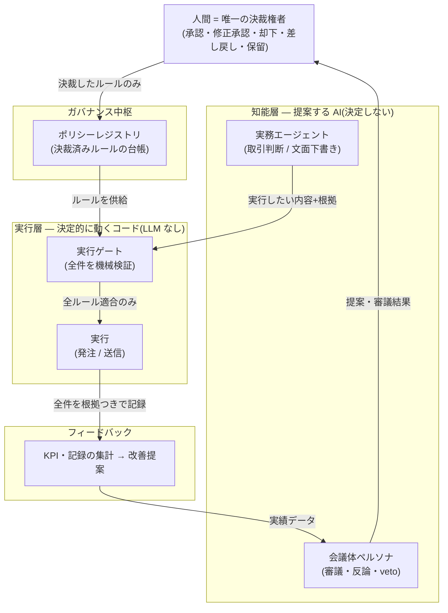
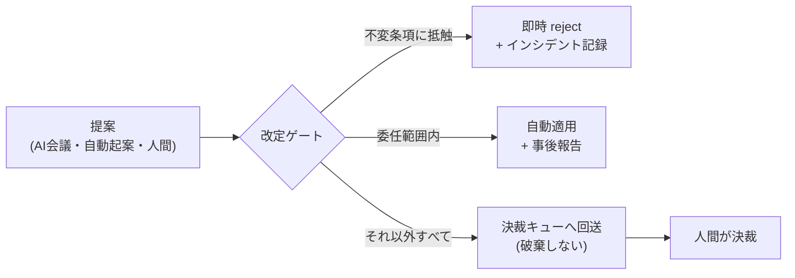
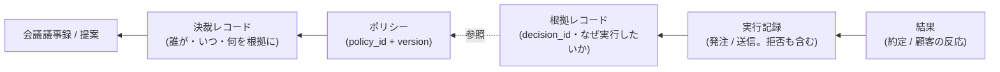

# ガバナンス・意思決定コア — 「AIが提案し、人間が決裁する」運用フレームワークの解説

| 項目 | 内容 |
|---|---|
| 位置づけ | 共通参照資料(非規範)。規範は本体一次資料(`docs/02_基本設計書.md` §1.5、`docs/03_運営規程・第0回アジェンダ.md`)にある |
| 実例 | **TradeCouncil**(自動売買・実装済み)と **SalesCouncil**(営業支援・[構想](../sales-council/README.md))。本文の実装参照はすべて TradeCouncil の実物 |
| 構成 | **第I部**(§1〜§5)= 非技術者向け: 考え方と全体像 / **第II部**(§6〜§13)= 設計者向け: メカニズムの詳細 |

---

# 第I部 仕組みの考え方

## 1. 一言で — これは何のための仕組みか

**AI に仕事をさせるとき、最大のリスクは「間違うこと」ではなく「暴走・逸脱・説明不能」である。**
間違い自体は人間も犯す。怖いのは、誰も決めていないルールで動き、気づかぬうちに逸脱し、
後から「なぜそうしたのか」を説明できないことだ。これは AI の性能の問題ではなく、
**統制(ガバナンス)の問題**であり、モデルを賢くしても解決しない。

このコアは、その統制を仕組みとして提供する:

> **AI が提案し、複数の視点で審議し、人間が決裁し、決裁済みのルールだけが実行を縛る。
> そして、すべての実行は「なぜそうしたか」へ後から必ず遡れる。**

ポイントは、これをルールブック(守ってほしいお願い)ではなく**構造**(破ろうとしても
経路が存在しない仕組み)として作ることにある。一次成果物は個別の取引ルールや
メール文面ではなく、**統制構造そのもの**である。

## 2. コアの6要素

| # | 要素 | 一言で |
|---|---|---|
| ① | **不変条項** | 会議の議題にすらできない「憲法」。AI 全員が賛成しても変えられない |
| ② | **三権分立** | 提案は誰でも自由・審議は多視点(AI)・**決裁は人間のみ** |
| ③ | **ポリシーレジストリ + fail-closed** | ルールは決裁済みの台帳だけが有効。**ルールが無い領域では動かない**(No Policy, No Action) |
| ④ | **二つのゲート** | ルール改定の振り分けゲートと、実行直前の検証ゲート。AI の出力はゲートを経ずに実行へ到達できない |
| ⑤ | **会議体** | わざと偏らせた複数の AI 人格に審議させ、全会一致の暴走を防ぐ(拒否権 = 審議差し戻し付き) |
| ⑥ | **根拠連鎖** | 結果 → 実行 → 人間の決裁 → 審議 → 提案まで途切れない記録。遡れない実行は 0 件を機械検証 |

これに**キルスイッチ**(人間はいつでも止められる。解除も人間専用)と、
**試走モード**(本番に影響しない paper / ドラフト運転)が横串で付く。

## 3. 全体像 — 提案から実行までの一方通行



読み方はひとつだけ覚えればよい: **AI から実行への直通線が存在しない**。
ルールにしたいことは必ず人間の決裁を通り、実行したいことは必ず実行ゲートを通る。
そして実行層は LLM を含まない決定的なコードであり、「気を利かせて」ルールの外側で
動くことができない。

## 4. ドメイン適用の実例 — 同じ構造が取引にも営業にも通る

コアの各要素が、実装済みの TradeCouncil と構想中の SalesCouncil でどう具体化するか:

| 汎用概念 | TradeCouncil(取引・実装済み) | SalesCouncil(営業・構想) |
|---|---|---|
| 取り返しのつかない操作 | 発注 | 顧客への送信・約束 |
| 失うもの | 資金 | 顧客の信頼・ブランド |
| 不変条項 | 5箇条(LLM 非執行・fail-closed 等) | 6箇条(+操作的コミュニケーション禁止) |
| ポリシー | P-01〜(決裁・委任 / レバレッジ / 損失上限…) | SP-C / SP-S / SP-K(会社 / ノウハウ / 顧客別) |
| 実行ゲート | risk_guard(損失上限・データ鮮度…) | 送信ゲート(宛先・NG 表現・権限内の約束…) |
| 実行記録 / 結果 | orders / fills | 送信記録 / 顧客の反応 |
| 根拠レコード | trade_decisions | communication_decisions |
| 試走モード | paper(仮想資金) | ドラフトのみモード(送信しない) |
| キルスイッチ | 全 BOT 停止(`var/run/KILL`) | 顧客別 / 担当別 / 全社の送信停止 |
| 決裁権者 | 利用者ひとり | 経営トップ+委任された営業担当(二層) |
| 第0回会議 | ★P-01〜P-04 決裁まで取引ゼロ | ★SP-C 決裁まで下書きゼロ |

この表の左列(汎用概念)が変わらない限り、**3列目を別のドメインに差し替えても仕組みは
成立する**。新しいドメインへの当てはめ方は第II部 §12 のチェックリストにまとめた。

## 5. 守ってくれること・守れないこと(正直な注記)

**守ってくれること** — 次の事故が「起こりにくい」ではなく**構造的に起こらない**:

- AI が勝手にルールを変えて動く(決裁なきルール変更の経路がない)
- AI の出力がそのまま実行される(実行ゲートを通らない経路がない)
- 説明できない実行が残る(根拠へ遡れない実行は 0 件を機械検証)
- 「ルール未整備のまま、なし崩しに運用が始まる」(fail-closed: 決裁されるまで動かない)

**守れないこと** — 構造だけでは防げず、運用と人間の規律に残るもの:

- **オーナー自身の迂回**: 決裁権者はコードを書き換えれば技術的には何でもできる。
  不変条項の意味は「エージェント・自動化・うっかりミスが迂回できない」ことの保証であり、
  オーナーの自己拘束は本人が決めて課すしかない
- **承認の形骸化**: AI の提案品質が上がるほど、人間は読まずに承認するようになる。
  決裁が形式だけになれば、この仕組みの安全性の前提は静かに崩れる(対策の議論は
  [SalesCouncil 05 §4](../sales-council/05_リスク・論点.md))
- **ルールの質**: 決裁プロセスは「悪いルールを良いルールに変える」ことまでは保証しない。
  保証するのは「誰が決めたか明確で、結果から学んで直せる」ことまで

---

# 第II部 設計メカニズム

> 以下、実装参照はすべて TradeCouncil の実物(パスは本体リポジトリ準拠)。
> 汎用に語れるよう、固有名は最小限にする。

## 6. ポリシーレジストリの解剖

ルールの台帳。真実源はバージョン管理されたポリシーファイル群(`config/policies/*.yaml`)で、
DB は監査用ミラー(決裁履歴は append-only)。実装: `core/governance/registry.py`。

### ポリシー1件の構造

```yaml
policy_id: P-03              # 台帳上の一意 ID
title: 口座リスク上限
status: active               # draft → proposed → approved → active → retired
version: 3                   # 決裁のたびに増分
value:                       # ルールの実質値(システムが読むのはここ)
  max_daily_loss_pct: 2.0
decision:                    # 決裁メタデータ(誰が・いつ・何を根拠に)
  decision_id: D-P-03-v003   # 「D-<policy_id>-v<version>」で機械的に採番
  decided_by: owner
  action: approve            # approve | modify_approve | reject | defer
  channel: sync_council      # 同期会議 | 非同期決裁 | 委任
  basis_refs: ["会議議事録パス", "根拠データ"]
  decided_at: "2026-06-22T21:00:00+09:00"
effective_from: 2026-06-23   # 未来日付で発効予約できる
review_after: 2026-09-01     # 期限到来で自動的に再上程(ルールの鮮度管理)
```

### 設計上の要点

1. **変更経路はひとつ**: 決裁レコードの記録(`record_decision()` = CLI の
   `tc policy record`)だけがポリシーを変更できる。YAML の手編集は pre-commit / hooks で
   検出する。reject / defer も「履歴だけ残して値は変えない」決裁として記録される
2. **fail-closed の基本素子**: 読み取りは `require(policy_id)` — 台帳に無い /
   active でない / 発効日未到来、のいずれでも例外で拒否する。さらに
   `require_value(policy_id, key)` は**キー粒度**で欠落を拒否する。
   つまり「コード内デフォルト値」が存在できない: たたき台の数値をうっかり既定値として
   持ち込む事故を、仕組みが防ぐ
3. **ロールバック = 再決裁**: 履歴は消せない。元に戻すことも「旧値を新バージョンとして
   決裁し直す」操作であり、決裁履歴に残る
4. **退役で fail-closed に戻る**: ポリシーを retire すると、その領域は「ルールなし」=
   動作拒否へ自動的に戻る
5. **生成ビューは確認用**: 実行用設定ファイル(`config/generated/`)は active ポリシーから
   自動生成される**確認ビュー**で、手編集禁止ヘッダ付き。システム自体はレジストリを
   直接読むため、「生成ファイルだけ書き換えて挙動を変える」ことができない

## 7. 二つのゲートとキルスイッチ

「ゲート」は2種類あり、役割が違う。混同しないこと。

### (A) 改定ゲート(decision_gate)— ルールを変えたい提案の振り分け

実装: `core/governance/decision_gate.py`。会議決議・自動起案・人間の起案をすべて
同じ入口で受け、3つに振り分ける:



- **不変条項の構造的検出**: 禁止キーの集合(例: `disable_kill_switch` /
  `bypass_decision_gate` / `disable_audit_log` / `disable_fail_closed` /
  `transfer_decision_authority` / `llm_direct_execution`)を提案内容に対して機械照合する。
  フレームワーク自体を対象にした提案も無条件 reject。**reject はインシデントとして記録**
  され、「AI 会議で全員賛成だったのに」という状況でも通らない
- **委任内の自動適用にも決裁の痕跡が残る**: 適用レコードは `decided_by: owner(delegated)`、
  根拠に「委任元ポリシーのバージョン」が刻まれる。つまり自動適用すら**権限の源泉
  (誰がいつ委任したか)へ遡れる**(委任の詳細は §11)
- **回送は破棄ではない**: 範囲外の提案は決裁キュー(proposals テーブル)に
  `pending_decision` で積まれ、人間の承認 / 却下 / 保留を待つ。提案を黙って握り潰す
  経路がない

### (B) 実行ゲート — 実行直前の唯一の関門

実装: `core/risk/guard.py`(取引版)。実行したいことすべてが、実行の直前にここを通る。

- **チェック順序が仕様**: ①キルスイッチ → ②必須ポリシーが active(No Policy, No Action)
  → ③未決裁領域の封鎖 → ④データ品質 → ⑤異常時の自動停止(サーキットブレーカ)→
  ⑥個別の上限群。しきい値は**すべて** active ポリシーの value から読む
- **型による権限分離**(実装の白眉): ゲートを通過した実行だけが「承認済み」型のオブジェクト
  になり、この型は**ゲートの内部でしか生成できない**(モジュール私有トークンで保護)。
  実行系(executor)はこの型しか受け取らない。つまり「ゲートを飛ばして実行を呼ぶ」コードは
  型レベルで書けず、テストで恒常的に検査される
- **拒否も一級の記録**: 拒否された実行も理由コード付きで実行テーブルに記録される
  (監査の一元化)。記録に失敗しても**拒否判断そのものは維持**される(fail-closed 優先)
- **防御方向は妨げない**: リスクを減らす操作(建玉の決済=取引版)は、上限チェックの
  対象から外す。「安全のための操作が安全装置に阻まれる」転倒を避ける設計
- **根拠の強制**: 実行要求の型は根拠レコードへの参照(decision_id)を必須フィールドに
  持つ。根拠なしの実行は、そもそも要求として組み立てられない

### キルスイッチ

人間はいつでも全停止できる(フラグファイル方式: `var/run/KILL`)。実行ゲートの
チェック順序の**先頭**にあり、他のどの判定よりも優先される。**解除は人間専用** —
エージェントにも自動化にも解除経路を与えない。

## 8. 会議プロトコル(R0〜R6)— 各ラウンドの設計意図

実装: `scenarios/council.md`(式次第の規範は `docs/03` 第3章)。
単なる進行表ではなく、各ラウンドに統制上の意図がある:

| ラウンド | 内容 | 設計意図 |
|---|---|---|
| R0 | 会議パッケージ提示(現状・KPI・議題・たたき台) | 全員が同じ事実から始める(情報の非対称を潰す) |
| R1 | ペルソナの**並列・独立**意見(相互不可視) | アンカリング防止。先に発言した者に引きずられない独立視点の確保 |
| R2 | 全員の意見を共有し、**各自1回だけ**反論・補強 | 多様性を保ったまま収束させる(無限の応酬をさせない)。veto はここで行使 |
| R3 | 決裁者の質疑(深掘り・追加シナリオ指示) | 人間が「分かったつもり」のまま決裁に進まないための介入点 |
| R4 | 選択肢を「案A / 案B / 保留」に確定 | **対立は丸めず併記**する。穏当な折衷案に自動収束させない |
| R5 | 決裁宣言(承認 / 修正承認 / 却下 / 差し戻し / 期限付き保留) | 決めるのは人間。保留も「期限付き」で立派な決裁 |
| R6 | 決裁レコード起草 → **読み上げて最終確認** → 唯一の適用経路で反映 | 人間決裁の最終防衛線。「言った・言わない」「思っていた値と違う」を潰してから台帳に入る |

- **veto は決裁ではない**: 拒否権を持つペルソナの veto は「審議段階の差し戻し」であり、
  人間の決裁を代替も拘束もしない。理由と代替案を必ず添える
- 議事録には反対意見・少数意見・veto を必ず残す(後の検証可能性のため)
- 1議題ずつ式次第を回す。複数議題の一括処理は、決裁の解像度を下げるためしない

## 9. 人格設計 — わざと偏らせ、補完させる

会議の品質はペルソナ設計で決まる。原則は3つ:

1. **意図的な偏り・弱みを設計し、消さない**: 各人格の定義ファイル
   (`.claude/agents/*.md`)には「苦手なこと(意図的に保持する弱み)」が明記される。
   例: 取引版のリスク管理者は「収益機会を評価する基準を持たない(過保守に寄る)」と
   自覚した上で、損失回避だけを使命とする。弱みは他の人格が補完する前提で組む。
   **全員が同じ方向を向いた多エージェントは1人と同じ** — 全会一致が続くなら
   それは合意ではなく設計ミスのシグナル
2. **拒否権は最少に**: veto を持つのは「破滅的な結果の回避だけを使命とする1名」のみ
   (取引版: risk_manager / 営業版構想: コンプライアンス人格)。乱発させず、
   本当に危険な提案のために重みを温存する
3. **実行基盤から独立させる**: 人格は frontmatter(backend / model)で LLM を選べる
   (Claude / OpenAI / Gemini 混在可)。どの人格がどのモデルで発言したかを成果物に
   明記する(再現性・モデル起因の偏りの検証可能性)

## 10. 根拠連鎖と監査 — 「なぜ」へ必ず遡れる



- **orphan 0 の機械検証**: 「根拠レコードへ遡及できない実行」が 0 件であることを
  KPI コマンド(`tc kpi`)が毎回検証する。0 でなければ不変条項違反 = 重大インシデント。
  監査を「人が頑張って徹底する」のではなく、破れたら鳴る仕組みにする
- **拒否・却下・veto も資産**: 実行ゲートの拒否は理由コード付きで実行テーブルに、
  改定ゲートの reject はインシデントに、会議の少数意見は議事録に残る。
  「やらなかったこと」の記録が次の判断の材料になる
- **決裁履歴は append-only**: 上書き・削除の操作が存在しない。ロールバックも新しい決裁
  として積まれる(§6)
- 人間が AI の提案をどう直したか(修正承認の差分)も記録される。これは
  「ルールと現場感覚のずれ」の直接観測であり、次のポリシー改定の自動起案の材料になる

## 11. 委任の構造 — 「全件人間決裁」から安全に緩める

すべてを人間が決裁する状態(初期値)は安全だが、スケールしない。緩め方も仕組みにする:

- **委任そのものがポリシー**(取引版: P-01)。`enabled` フラグと `scopes`
  (対象ポリシー+変更してよいキーの許可リスト)で「自動適用してよい範囲」を定義する
- **委任範囲の変更は常に人間の決裁事項**: 改定ゲートは、委任ポリシー自身への変更を
  scopes に何が書いてあっても自動適用しない(自分で自分の権限を広げる経路を塞ぐ)
- **初期値は「委任なし(全件決裁)」**: 緩めるのは実績を見てから。fail-closed の思想を
  権限設計にも適用する
- **単一オーナー → 組織への拡張**: 「オーナーが範囲を区切って委任し、委任先の決裁も
  権限の源泉へ遡れる」構造は、そのまま組織の決裁階層になる。営業版構想の二層決裁
  (経営トップ → 営業担当。[SalesCouncil 02 §3.4](../sales-council/02_TradeCouncil対応設計.md))は
  この拡張の実例

## 12. 新ドメインへの移植手順(チェックリスト)

「この枠組みはいろいろな場面で流用できる」を、実行可能な8ステップに落とす。
各ステップの答えが揃えば、そのドメイン版の第0回会議を開ける:

| # | ステップ | 中心の問い | 実例(取引 / 営業) |
|---|---|---|---|
| 1 | 取り返しのつかない操作の特定 | この領域で「実行」と呼ぶべき、撤回できない操作は何か | 発注 / 顧客への送信・約束 |
| 2 | 不変条項の翻訳 | 議題にすらさせない憲法は何箇条か(LLM 非実行・監査ログ・キルスイッチ・fail-closed は共通) | 5箇条 / 6箇条(+操作的手法の禁止) |
| 3 | ★必須ポリシーの定義 | 「これが決裁されるまで一切動かない」ルールはどれか | P-01〜P-04 / ★SP-C 一式 |
| 4 | 実行ゲートの検証項目 | 実行直前に機械検証すべき項目と順序は何か(キルスイッチと必須ポリシー確認は常に先頭) | 損失上限・データ鮮度… / 宛先・NG 表現・権限内の約束… |
| 5 | 試走モードの設計 | 本番に影響させずに品質を測る運転モードは何か。本番切替のゲート基準は | paper / ドラフトのみモード |
| 6 | 根拠連鎖のスキーマ | 結果から決裁まで遡るために、何と何を ID で繋ぐか。orphan 0 をどう機械検証するか | trade_decisions / communication_decisions |
| 7 | 人格編成 | どんな偏りの組をつくるか。対抗軸はあるか。veto は誰に1つだけ持たせるか | 5名+risk_manager / 5名+コンプライアンス |
| 8 | 第0回会議の開催 | ★ポリシーを R0〜R6 で決裁する。**決裁されるまで動かさない** | 第0回意思決定会議 / 第0回営業ポリシー決裁会議 |

順序に意味がある: 1〜2(何を守るか)を決めずに 4(どう検証するか)から始めると、
ゲートが「とりあえず動かすための飾り」になる。**ルールが先、実行は後** — それがこのコアの
一行要約でもある。

## 13. 用語ミニ対訳

| 汎用 | TradeCouncil(取引) | SalesCouncil(営業・構想) |
|---|---|---|
| No Policy, No Action | No Policy, No Trade | No Policy, No Send |
| 実行ゲート | risk_guard | 送信ゲート |
| 実行記録 / 結果 | orders / fills | 送信記録 / 顧客の反応 |
| 根拠レコード | trade_decisions | communication_decisions |
| 試走モード | paper | ドラフトのみモード |
| 改定ゲート | decision_gate | ポリシー改定ゲート |
| veto 保持人格 | risk_manager | コンプライアンス人格 |
| 決裁権者 | 利用者(単一オーナー) | 経営トップ+委任された担当(二層) |
| 第0回会議 | 第0回意思決定会議 | 第0回営業ポリシー決裁会議 |
