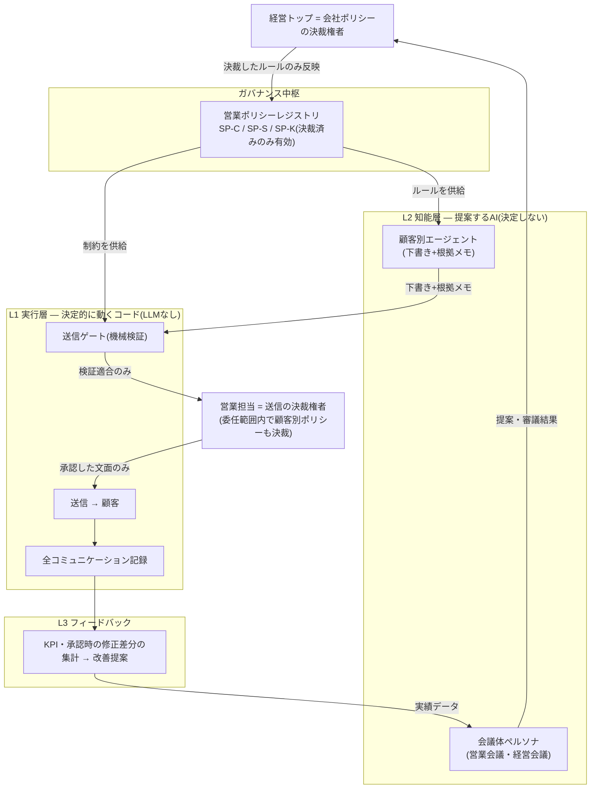

# SalesCouncil 構想概要

| 項目 | 内容 |
|---|---|
| 位置づけ | 構想(アイデア)。docs/ の一次仕様ではなく、TradeCouncil 本体の仕様・ポリシー・挙動を一切変更しない |
| 効力 | 非規範。本書の数値・ポリシー案はすべてたたき台であり、決裁されたものは存在しない |
| 流用元 | TradeCouncil のガバナンス設計(`docs/02_基本設計書.md` §1.5、`docs/03_運営規程・第0回アジェンダ.md`) |

## 1. ビジョン — 「AIに営業を支援させても、顧客への約束は人が握る」

SalesCouncil は、営業の暗黙知 — 会社の営業方針、担当者個人のノウハウ、顧客ごとの勘所 —
を、**会議と決裁を通じて監査可能な形式知(ポリシー)へ変換し続ける組織学習装置**である。
一次成果物は個別のメール文面ではなく、「決裁を経ない対外コミュニケーションが構造的に
不可能」な統制基盤そのもの(TradeCouncil の設計思想の継承)。

なぜ自動売買フレームワークが営業に流用できるのか。両者は**リスクの種類が違うだけで
構造が同型**だからである:

| | TradeCouncil | SalesCouncil |
|---|---|---|
| AI が誤ると失うもの | 資金(金銭リスク) | 顧客の信頼・ブランド(信用リスク) |
| 取り返しのつかない操作 | 発注 | 顧客への送信・約束 |
| 守るべき構造 | AI 出力は検証と人間決裁を経ない限り発注に到達しない | AI 出力は検証と人間承認を経ない限り顧客に到達しない |
| ルールの置き場 | ポリシーレジストリ(決裁済みのみ有効) | 同じ(営業ポリシーレジストリ) |
| 学習ループ | 取引実績 → KPI → 会議 → ポリシー改定 | 顧客の反応・承認時の修正差分 → KPI → 会議 → ポリシー改定 |

生成 AI を営業に使うこと自体は誰でもできる。差がつくのは「AI が何を根拠に書き、誰が
責任を持ち、結果から何を学んだか」を**後から全部説明できる**かどうかであり、それが
本構想の中心価値である。

## 2. 解決したい課題

- **営業ノウハウの属人化**: トップ営業の知見が個人の頭の中にあり、退職・異動で失われる。
  ポリシーとプレイブックへの形式知化で組織の資産に変える
- **顧客対応品質のばらつき**: 担当・タイミングによって文面の質とトーンが揺れる。
  決裁済みポリシーを共通の足場にして下限品質を底上げする
- **野良 AI 利用の統制不在**: 現場が各自の判断で生成 AI に顧客情報を貼り付け、根拠不明の
  文面を送る状態は、誤情報・トーン事故・情報漏えいの温床。統制された経路を「使われる形」で提供する
- **経営方針と現場実務の断絶**: 「方針」がスローガンで終わり、現場の文面・行動に落ちない。
  方針をポリシー(機械が読める制約と判断基準)として表現し、下書きに直接反映させる
- **コミュニケーション履歴の死蔵**: メール・電話のやり取りが個人の受信箱に眠り、
  顧客理解が CRM の静的属性で止まる。履歴から顧客別ポリシーを起案し、対応知見を蓄積する
- **経営会議の多視点性が人手任せ**: 数字の見える化と論点出しが属人的。KPI パッケージと
  複数エージェント審議で、決裁者(経営トップ)が判断に集中できる形に整える

## 3. 登場人物と権限モデル(提案・審議・決裁の三権分立)

TradeCouncil の権限モデル(docs/02 §1.5.1)の営業版。**提案は自由、適用は決裁のみ**。

| 権限 | 保有者 | 内容 |
|---|---|---|
| 提案権 | エージェント(会議・自動起案)、実績データ、社員の誰でも | 何でも提案できる(値引き権限・トーン・顧客ポリシー含む) |
| 審議権 | 会議体ペルソナ群(営業会議・経営会議) | 提案を多視点で揉み、決裁しやすい形(選択肢+推奨+根拠+リスク)に整える。コンプライアンス人格の veto は**審議段階の差し戻し**であり決裁の代替ではない |
| 決裁権 | **人間のみ**(対象により階層化、下記) | 承認 / 修正承認 / 却下 / 差し戻し / 期限付き保留 |

### 二層の決裁権者(本構想の最重要概念)

TradeCouncil は「利用者ただ一人」の単一オーナー前提だが、営業組織では決裁が階層化する。
これを**委任の構造**(TradeCouncil の P-01 決裁・委任規程と同型)で表現する:

| 決裁権者 | 決裁対象 |
|---|---|
| **経営トップ** | 会社ポリシー(SP-C)の全件。委任範囲の設定・変更・撤回そのもの |
| **営業担当** | 自分の担当顧客への**送信**と、委任範囲内での顧客別ポリシー(SP-K)改定 |

担当の権限はすべて「経営トップが SP-C で委任した範囲」に由来し、監査ログ上も権限の
源泉が経営トップの決裁に遡れる。委任範囲を超える案件(大幅値引き・センシティブな対応)は
自動的に決裁キューへ回送される。詳細は [02_TradeCouncil対応設計](02_TradeCouncil対応設計.md) §3.4。

そのほかの登場人物: **顧客別エージェント**(下書き・提案のみ。決定しない)/
**会議体ペルソナ**(審議のみ)/ **ファシリテーター**(進行・起草。決定しない)/
**送信ゲート**(決定的コード。人格を持たず、検証だけを行う)。

## 4. 基本原則 — 営業版不変条項(議題にできない6箇条)

以下はポリシーではなくフレームワークの一部であり、**会議の議題にできない**
(TradeCouncil 不変条項5箇条の翻訳+営業固有の1箇条)。

1. **送信・約束の決裁権は人間のみ**: AI は下書き・提案まで。顧客に到達する文面、
   価格・納期・仕様などの約束は、権限ある人間の承認なしに成立しない
2. **LLM 非送信原則**: LLM の出力が検証ゲート(送信ゲート)を経ずに顧客・社外へ
   到達する経路を実装しない
3. **全コミュニケーションの監査ログ**: 指示 → 参照ポリシー・履歴 → 下書き → 修正 →
   承認 → 送信 → 結果を欠落なく記録する
4. **キルスイッチ**: 人間はいつでも停止できる(顧客単位・担当単位・全社一括)。解除も人間専用
5. **No Policy, No Send(fail-closed)**: 必須ポリシーが active でない顧客・領域では、
   下書き生成・送信支援を拒否する
6. **操作的コミュニケーションの禁止**(営業固有): 顧客の脆弱性や認知バイアスを意図的に
   突く文面最適化、AI 関与の社内的な隠蔽を行わない(対外開示の水準は論点 →
   [05_リスク・論点](05_リスク・論点.md) Q-02)

> 正直な注記(TradeCouncil docs/02 §1.5.2 の翻訳): 経営トップはコードを書き換えれば
> 技術的には何でもできる。不変条項の意味は「**エージェント・自動化・うっかりミスが
> これらを迂回できない**」ことの構造的保証にある。

## 5. 全体像 — 三層構造とデータの流れ

ポイントは矢印の向き(TradeCouncil エグゼクティブ概要 図1と同じ読み方):
**AI から顧客への直通線は存在しない**。下書きは必ず送信ゲートの検証と営業担当の承認を
経由し、ポリシーは必ず人間の決裁を経由する。

## 6. スコープと成功イメージ

### 初期スコープ

- **メール文面の下書き支援(コパイロット)**: 営業担当が責任者として指示し、顧客別
  エージェントが下書きし、担当が承認して送る
- 電話・対面は**データソース**(書き起こし・記録 → 顧客ポリシーの材料)であり、
  リアルタイムの会話支援はスコープ外
- プロモーション(一斉配信)と経営会議は段階導入の後半・並走候補
  ([04_ロードマップ](04_ロードマップ.md))

### 非ゴール

- AI による自律送信・顧客対応の完全自動化(不変条項により対象外)
- 人員削減を一次目的にしない(狙いはノウハウの資産化と品質の底上げ)
- SFA・CRM の置き換え(履歴・属性の真実源としては既存システムと連携する)

### 成功イメージ(測れる形で)

| 指標 | 見たい変化 |
|---|---|
| 下書き採用率(無修正承認率) | 上昇 = ポリシーと人格調整が効いている |
| 一次返信リードタイム | 短縮 = 支援が現場の速度になっている |
| 新任担当の引き継ぎ期間 | 短縮 = 顧客ポリシーが組織の資産になっている |
| ポリシー違反・誤送信インシデント | 0 を維持(送信ゲートの存在意義) |
| 根拠連鎖の orphan(遡及できない送信) | 常に 0(機械検証) |

数値目標そのものはたたき台すら置かない。決めるのは会議と決裁である
(TradeCouncil「たたき台値をハードコードしない」原則の文書版)。

## 7. 本書の読み方

- 流用の設計的な勘所(概念マッピング・ポリシー三層・送信ゲート・人格のガバナンス)
  → [02_TradeCouncil対応設計](02_TradeCouncil対応設計.md)
- 実際の動き(メール作成・人格調整・プロモーション・経営会議)
  → [03_ユースケース](03_ユースケース.md)
- 進め方(リスク勾配と段階導入) → [04_ロードマップ](04_ロードマップ.md)
- 危ない話と決め所(個人情報・倫理・未決定論点・撤退基準)
  → [05_リスク・論点](05_リスク・論点.md)
