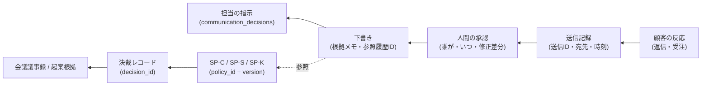

# TradeCouncil 対応設計(概念マッピング)

| 項目 | 内容 |
|---|---|
| 位置づけ | 構想(アイデア)。docs/ の一次仕様ではなく、TradeCouncil 本体の仕様・ポリシー・挙動を一切変更しない |
| 効力 | 非規範。本書の数値・ポリシー案・YAML 例はすべてたたき台であり、決裁されたものは存在しない |
| 流用元 | `docs/02_基本設計書.md` §1.5、`docs/03_運営規程・第0回アジェンダ.md`、`scenarios/council.md`、`core/governance/`、`core/risk/guard.py` |

## 1. マッピングの方針 — 構造を継承し、語彙を翻訳する

TradeCouncil から持ってくるのは**コードではなく構造**である:

- 権限の三権分立(提案は自由・審議は多視点・適用は決裁のみ)
- fail-closed(必須ポリシーなしでは動かない。キー粒度でも欠落を拒否)
- 根拠連鎖(すべての実行が決定レコードへ遡及できる。orphan 0 を機械検証)
- 意図的に偏らせた人格設計と相互補完(veto を含む)
- 会議プロトコル(独立意見 → 相互反論 → 人間の決裁 → 決裁レコード)

その上でドメイン語彙を翻訳する: 発注 → 送信、損失 → 信用毀損、約定 → 顧客の反応。
実装形態(別リポジトリでの新規実装か、本体コードのどこまでを流用するか)は本構想では
決めない([05_リスク・論点](05_リスク・論点.md) Q-08)。

## 2. 概念マッピング表(全体)

| TradeCouncil(実体) | SalesCouncil(構想) | 継承 | 詳細 |
|---|---|---|---|
| ポリシーレジストリ(`config/policies/*.yaml` + `core/governance/registry.py` の `require()` / `require_value()`) | 営業ポリシーレジストリ(SP-C / SP-S / SP-K の三層)。キー粒度 fail-closed も同じ | そのまま | §3 |
| 決裁レコード(decision_id / decided_by=owner / action / channel / basis_refs / decided_at) | 同形式。decided_by が役割別(経営トップ / 担当)に拡張 | 翻訳 | §3.4 |
| `config/generated/`(active ポリシーからの自動生成ビュー・手編集禁止) | **顧客別人格ファイル**(決裁済み SP-K からの生成物・手編集禁止) | そのまま | §5.1 |
| decision_gate の3分岐(不変条項 reject / 委任内 auto-apply / 決裁キュー回送。`core/governance/decision_gate.py`) | ポリシー改定ゲート(同3分岐)。権限超過案件のエスカレーション回送にも同型を再利用 | そのまま | §4(A) |
| risk_guard(発注前の唯一の関門。`core/risk/guard.py`) | **送信ゲート**(宛先・NG 表現・権限内の約束か・開示範囲の機械検証) | 翻訳 | §4(B) |
| 発注(orders)/ 約定(fills) | 送信(送信記録)/ 顧客の反応(返信・受注) | 翻訳 | §6 |
| trade_decisions(rationale 付き根拠起票) | communication_decisions(なぜこの文面か: 指示・参照ポリシー・参照履歴) | 翻訳 | §6 |
| キルスイッチ(`var/run/KILL`。解除 resume は人間専用) | 送信停止スイッチ(顧客別 / 担当別 / 全社。解除は人間専用) | そのまま | 01 §4-④ |
| ペルソナ5名(意図的な偏り+risk_manager の veto) | 会議体ペルソナ+**コンプライアンス人格**(唯一の veto) | 翻訳 | §5.3・§7 |
| 悪 BOT 判定・淘汰(P-05) | 効かない営業パターン・陳腐化した顧客ポリシーの降格・退役 | 翻訳 | §8 |
| watchdog / heartbeat(死活監視) | 対応漏れ・放置検知(返信 SLA・フォロー期限の監視) | 翻訳 | — |
| paper / live の分離(Phase 0 は paper のみ) | **ドラフトのみモード / 実送信モード**の分離 | 翻訳 | [04](04_ロードマップ.md) |
| `tc kpi`(根拠連鎖 orphan 0 の機械検証) | 送信 orphan 0 検証+営業 KPI(採用率・修正率・SLA) | そのまま | §6 |
| 戦略カード(`docs/strategies/`。仮説・合格基準・学び append-only) | 営業プレイブックカード(SP-S 層の知識源) | そのまま | §8 |
| 第0回意思決定会議(`scenarios/council.md`。★決裁まで fail-closed) | 営業版第0回(★SP-C 決裁まで送信支援ゼロ) | そのまま | [03](03_ユースケース.md) UC-0 |
| 不変条項5箇条 | 営業版不変条項6箇条 | 翻訳+追加 | [01](01_構想概要.md) §4 |

## 3. ポリシー体系 — 三層構造と二層の決裁権者

### 3.1 ポリシーの三層(会社 / 営業ノウハウ / 顧客別)

本体の `P-` と接頭辞を分けて(`SP-` = Sales Policy)混同を防ぐ。

| 層 | ID 体系(案) | 内容の例 | 既定の決裁権者 |
|---|---|---|---|
| **会社**(Company) | `SP-C-NN` | ガバナンスコード、コンプライアンス基準、ブランドトーン、価格・値引き権限、情報開示範囲、AI 利用方針、決裁・委任規程 | 経営トップ |
| **営業ノウハウ**(Sales playbook) | `SP-S-NN` | セグメント別アプローチ、提案の型、失注からの学び、フォロー間隔の定石 | 経営トップ(委任可) |
| **顧客別**(Kokyaku) | `SP-K-<顧客ID>-NN` | 敬称・口調、チャネル選好、NG 話題、キーパーソン、確定済み契約条件への参照、対応上の注意 | 担当営業(SP-C の委任範囲内) |

形式は本体のポリシー YAML(docs/02 §1.5.3)を踏襲する。形式イメージ(すべてたたき台・架空):

```yaml
# 会社層の例
policy_id: SP-C-03
title: 価格・値引き権限規程
status: active            # draft → proposed → approved → active → retired
version: 1
value:
  quote_source: price_master      # 提示価格は価格マスタに由来すること
  max_discount_pct_by_role:
    sales_rep: 10                 # 担当が自走で承認できる上限(たたき台)
    sales_manager: 15
  beyond: escalation              # 超過は決裁キューへ回送
decision:
  decision_id: D-SP-C-03-v001
  decided_by: ceo                 # 会社層は経営トップのみ
  action: approve                 # approve | modify_approve | reject | defer
  channel: sync_council
  session_ref: sales-council-0
  basis_refs: ["第0回営業ポリシー決裁会議 議事録"]
  decided_at: "2026-07-01T10:00:00+09:00"
review_after: "2026-10-01"
```

```yaml
# 顧客別層の例(顧客は架空)
policy_id: SP-K-aozora-01
title: あおぞら商事(架空)コミュニケーション・ポリシー
status: active
version: 4
value:
  tone: "結論先行・簡潔。過度な敬語・絵文字は使わない"
  channel_preference: "メール中心。電話は緊急時のみ(午前は避ける)"
  key_persons: ["購買部 佐藤様(意思決定)", "技術部 田中様(技術評価)"]
  ng_topics: ["他社導入事例の社名出し", "納期の口頭確約"]
  agreed_terms_ref: "契約DB #aozora"   # 確定事項は原本参照(本文へ転記しない)
decision:
  decision_id: D-SP-K-aozora-01-v004
  decided_by: sales_rep            # SP-C の委任範囲内で担当が決裁
  action: modify_approve
  channel: async_approve
  basis_refs: ["履歴からの自動起案 #123", "担当の修正コメント"]
  decided_at: "2026-07-15T18:30:00+09:00"
review_after: "2026-09-01"         # 顧客層は短サイクルの見直しを必須とする
```

### 3.2 優先順位と衝突解決

1. **上位層優先**: 会社 > 営業ノウハウ > 顧客別。SP-K がどう望んでも SP-C の制約は破れない
2. **同位では厳しい方が勝つ**: 同じ事項に複数の制約が掛かるときは、より保守的な制約を採る
3. **顧客別ポリシーは、上位が明示的に開放したキーのみ上書きできる**: SP-C の委任規程が
   「担当が SP-K で調整してよいキー」(tone・channel_preference 等)を許可リストで定義する。
   本体 P-01 の delegation scopes(対象ポリシー+キーの許可リスト)と同型

規則で解決できない衝突を検出したら **fail-closed**: その文面は自動処理せず、理由付きで
人間へエスカレーションする。

### 3.3 ライフサイクルと必須ポリシー(★)

- 状態遷移は本体と同じ: `draft → proposed → approved → active → retired`。
  ロールバック = 旧バージョンの再決裁(決裁履歴は append-only で不滅)
- **★必須ポリシー**: 会社層の★一式(AI 利用方針・価格権限・ブランドトーン・委任規程
  あたりが候補。確定は第0回会議)が active になるまで、**全社で送信支援を拒否**する。
  顧客の SP-K が未決裁なら、その顧客への下書きを拒否する(完全拒否か最保守の汎用モード
  かは未決定 → [05](05_リスク・論点.md) Q-01)
- 顧客別ポリシーは鮮度が命のため `review_after` を必須とし、期限到来で自動再上程する
  (本体 FR-10.6 の翻訳)

### 3.4 決裁権の階層 — P-01 委任構造の流用

TradeCouncil は単一オーナー前提(decided_by は owner 以外を拒否)だが、営業組織では
決裁が階層化する。これを「**経営トップが委任規程(SP-C)で、担当へ委任する範囲を定義する**」
ことで表現する — 本体 P-01(決裁・委任規程)の組織版:

```yaml
# SP-C-01 決裁・委任規程の value 部の形式イメージ(たたき台)
delegation:
  enabled: true
  scopes:
    - role: sales_rep
      targets: ["SP-K-*"]                       # 自分の担当顧客の顧客別ポリシー
      keys: ["tone", "channel_preference", "ng_topics", "key_persons"]
      condition: "SP-C 系の制約に適合すること(逸脱は決裁キューへ)"
    - role: sales_rep
      targets: ["send_approval"]                # 日常の送信承認
      condition: "送信ゲート適合かつ約束事項が権限内であること"
```

- 委任範囲の変更そのものは**常に経営トップの決裁事項**(decision_gate が P-01 自身の
  自動適用を拒否するのと同じパターン)
- 担当の承認・決裁はすべて「委任に基づく決裁」として記録され、監査ログ上も権限の源泉が
  経営トップの決裁レコードへ遡れる

## 4. 送信ゲート — decision_gate と risk_guard の翻訳

TradeCouncil では「ポリシー改定の振り分け(decision_gate)」と「発注前検証(risk_guard)」は
**別物**である。営業版でも 2 つを分けて翻訳する。

### (A) ポリシー改定ゲート = decision_gate の3分岐(そのまま)

| 入力(提案・改定案) | 振り分け |
|---|---|
| 不変条項に抵触(下記の禁止キーを含む) | **即時拒否**+警告通知+事故として記録 |
| 委任範囲内(SP-C の delegation scopes 内) | **自動適用**+事後報告 |
| それ以外すべて | **決裁キューへ回送**(破棄しない) |

禁止キーの営業版(本体 `FORBIDDEN_CONTENT_KEYS` の翻訳・例):
`auto_send_enabled` / `bypass_human_approval` / `disable_send_log` / `disable_kill_switch`。
これらを含む提案は、会議で全員が賛成しても機械的に reject される。

同じ3分岐は**日常案件のエスカレーション**にも再利用できる: 顧客の要求(値引き 15%)が
担当の委任(10%)を超える → 自動で上長の決裁キューへ回送([03](03_ユースケース.md) UC-1
例外フロー)。

### (B) 送信ゲート = risk_guard の翻訳(送信前の唯一の関門)

下書きが営業担当に提示される前・送信される前に、決定的コードが全件検証する。
検証項目の候補(確定は決裁):

| 検証 | 内容(TradeCouncil の対応物) |
|---|---|
| 必須ポリシー active | ★SP-C 一式+当該顧客 SP-K(P-01〜P-04 の require_all) |
| キルスイッチ | 顧客・担当・全社いずれかの停止指定(var/run/KILL) |
| 宛先検証 | 宛先ドメイン・担当顧客との照合、誤送信防止(資産クラス封鎖) |
| 約束表現の検出 | 価格・値引き率が権限内か、納期・仕様の確約表現の検出(1取引最大損失・レバ上限) |
| NG 表現・誇大表現 | SP-C のブランドトーン・コンプライアンス基準(サーキットブレーカ) |
| 開示範囲 | 他顧客情報・社外秘の混入検出(これは新規要素。§9) |
| 添付の妥当性 | 添付ファイルの宛先適合(同上) |

拒否は理由コード付きで記録される(reject も監査ログの一部 — 本体 orders の
status=rejected と同じ思想)。

## 5. 顧客別人格エージェントの生成とガバナンス

### 5.1 人格 = 決裁済み顧客ポリシーから生成されるビュー

原案の「顧客にフィットするように人格まで調整する」を、**野放しの人格編集にしない**ことが
本構想の最重要設計判断である。

- 顧客別人格ファイル(本体 `.claude/agents/*.md` と同様の frontmatter+本文)は
  **決裁済み SP-K から自動生成される成果物**とし、手編集を禁止する
- 本体の「`config/generated/` は active ポリシーからの自動生成ビュー・手編集は検出対象」
  (registry の generate_views パターン)の流用
- これにより「人格を調整する」=「SP-K を改定決裁する」となり、**人格の変更が必ず
  決裁履歴に残る**。誰がいつなぜこの口調・この接し方にしたのか、後から全部説明できる

### 5.2 人格調整の決裁フロー

- 軽微な調整(tone 等、委任で開放されたキー): 担当が SP-K を改定決裁 → 人格を再生成(即日)
- 大幅な変更・センシティブな項目: 決裁キューへ回送し上位が決裁
- 新規顧客の初期生成・履歴からの自動起案は [03](03_ユースケース.md) UC-2

### 5.3 意図的な偏りと対抗軸 — コンプライアンス人格の veto

TradeCouncil の人格設計思想(意図的な偏り・弱みを保持し、相互補完させる)を顧客別
エージェントにも適用する。

- 顧客別エージェントは構造的に「**この顧客に好かれる**」方向へ偏る(それが存在意義)。
  偏り自体は消さない
- だからこそ対抗軸として、**顧客に一切迎合しないコンプライアンス人格**を送信前レビューに
  常置する(risk_manager の翻訳)。使命は受注ではなく**信用毀損の回避だけ**。
  唯一の veto(下書きの差し戻し)を持ち、理由と代替案を必ず添える。過保守に寄る弱みも
  意図的に保持する(過保守で失う機会は担当の判断で拾える。逆は拾えない)

## 6. 根拠連鎖の営業版

すべての送信が「なぜこの文面か」へ遡及できる(本体 fills → orders → trade_decisions
→ 会議決裁の翻訳)。



- **orphan(遡及できない送信)0 件**を KPI コマンドで機械検証する(`tc kpi` の翻訳)。
  orphan > 0 は不変条項違反 = 重大インシデント
- 営業固有の価値: **承認時の修正差分そのものが学習データになる**。担当が下書きのどこを
  直したかは「ポリシーと現場感覚のずれ」の直接観測であり、SP-K / SP-S 改定の自動起案や
  プレイブックの学び欄の入力になる(原案にない学習ループ)

## 7. 会議体とシナリオプロトコルの対応

| 会議 | 頻度(案) | 決裁権者 | 主な内容 |
|---|---|---|---|
| 第0回(キックオフ) | 1回 | 経営トップ | ★SP-C 一式の決裁(UC-0)。これまで送信支援ゼロ |
| 営業定例 | 週次 | 担当(委任内)/ 上長 | SP-K 改定、difficult case の合議、KPI 確認 |
| 経営会議 | 月次 | 経営トップ | SP-C / SP-S 改定、KPI レビュー、review_after 到来分の再審議 |
| 臨時 | 随時 | 案件による | クレーム・重大案件・インシデント |

- 進行は本体 `scenarios/council.md` の式次第をそのまま流用する:
  R0 会議パッケージ提示 → R1 ペルソナ独立意見(並列・相互不可視)→ R2 相互反論(veto は
  ここ)→ R3 決裁者質疑 → R4 選択肢確定(対立は丸めず併記)→ R5 決裁宣言 →
  R6 決裁レコード起草・読み上げ確認・適用
- ペルソナ編成のたたき台(**編成自体を第0回の議題とする** — 本体 P-12 の翻訳):

| ペルソナ(案) | レンズ | 意図的な偏り(本体の対応) |
|---|---|---|
| ハンター | 新規開拓・攻め | 強気に寄る(momentum_trader) |
| ファーマー | 既存深耕・関係維持 | 現状維持に寄る(contrarian_value) |
| カスタマーアドボケート | 顧客の立場 | 顧客利益に寄る(macro_analyst の視座の置き換え) |
| データ検証 | 「その施策は数字で裏付くか」 | 定量に寄る(quant_validator) |
| コンプライアンス | 信用毀損の回避だけ。**唯一の veto** | 過保守に寄る(risk_manager) |

- 各人格は本体と同じ仕組み(`.claude/agents/` 形式の定義+backend/model 指定で
  Claude / OpenAI / Gemini を混在可)で動かせる

## 8. データ基盤 — 履歴の蓄積と自動起案

真実源の役割分担(本体「数値は DB、解釈はカード」の翻訳):

| 置き場 | 役割 |
|---|---|
| コミュニケーション履歴 DB | メール・通話書き起こし等の原本(append-only)。**生データはここだけ** |
| 営業ポリシーレジストリ(SP-*) | 決裁済みの判断基準・制約。生ログを転記しない(抽象化した方針のみ) |
| プレイブックカード | 仮説・合格基準・学び(append-only)。数値は DB 参照、カードは解釈 |

- **履歴からの SP-K 自動起案**: メール・通話の履歴を解析して SP-K の draft を起案する
  (本体の「実績データ(自動起案)」パターン)。**起案は自動でも、適用は必ず人間の決裁**
- 生ログをポリシーへ転記しない原則は、ノウハウの鮮度管理だけでなく個人情報の最小化としても
  効く([05](05_リスク・論点.md) §2)
- 効かなくなった営業パターン・陳腐化した SP-K は、KPI を根拠に降格・退役させる
  (悪 BOT 淘汰の翻訳)。退役しても記録は残す(失敗の記録が資産)

## 9. 流用しないもの・新規に必要なもの

**流用しない**(取引ドメイン固有):
レバレッジ・証拠金・維持率、取引所アダプタ(`core/exchange/`)、価格サーキットブレーカ、
スリーブ配分。そして**単一オーナー前提の認証モデル**(§3.4 の通り委任構造で置き換える)。

**新規に必要**(TradeCouncil に対応物がない):

| 新規要素 | 備考 |
|---|---|
| メール送受信連携(送信ゲートの実装点) | 接続形態は未定([05](05_リスク・論点.md) §7) |
| 通話録音の書き起こしパイプライン | 同意取得・精度・コストの論点あり |
| CRM / SFA 連携(顧客マスタ・案件の真実源調整) | 置き換えではなく連携 |
| 個人情報のマスキング・仮名化層 | 外部 LLM へ送出する前段(Q-05 の前提) |
| マルチユーザー認証・権限管理 | 本体との最大のアーキテクチャ差分 |

正直な見立て: ガバナンス構造は流用で立ち上がるが、**実装コストの主戦場はこの新規要素側**
にある。だからこそ構想段階でガバナンスを固定し、実装判断(Q-08)を軽くする。
