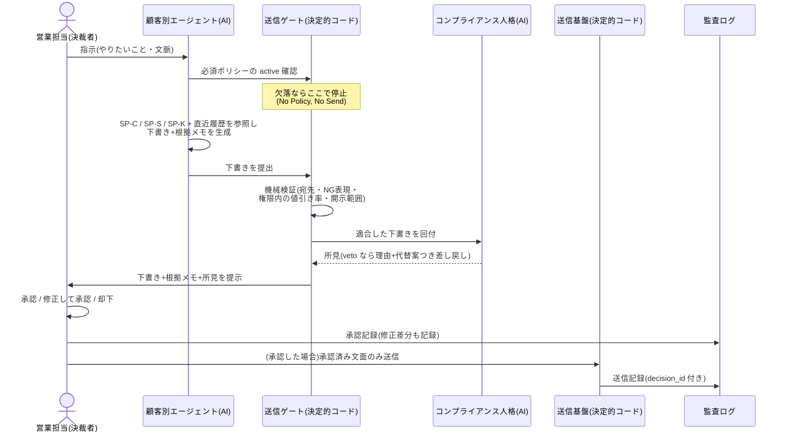

# ユースケース集

| 項目 | 内容 |
|---|---|
| 位置づけ | 構想(アイデア)。docs/ の一次仕様ではなく、TradeCouncil 本体の仕様・ポリシー・挙動を一切変更しない |
| 効力 | 非規範。本書の数値・社名・人名はすべてたたき台・**架空**であり、決裁されたものは存在しない |
| 流用元 | `scenarios/council.md`(R0〜R6 式次第)、`docs/03_運営規程・第0回アジェンダ.md` |

## 0. 共通の前提と記法

- 登場人物: 経営トップ(SP-C の決裁権者)/ 営業担当(送信の決裁権者・指示者)/
  顧客別エージェント(AI・下書きのみ)/ 会議体ペルソナ(AI・審議のみ)/
  送信ゲート(決定的コード)/ コンプライアンス人格(AI・veto 保持)
- 各 UC の記述フォーマット: **トリガー / 事前条件(必要な active ポリシー)/ 基本フロー /
  例外フロー / 残る根拠連鎖 / 対応する TradeCouncil パターン**
- 例示の「あおぞら商事」「佐藤様」、値引き率などの数値はすべて架空・たたき台

## UC-0 第0回営業ポリシー決裁会議(すべての起点)

- **トリガー**: 導入の意思決定。システム実装の有無にかかわらず開催できる(文書と会議だけで成立)
- **事前条件**: なし(これが最初の1歩)
- **基本フロー**(本体 `scenarios/council.md` R0〜R6 の翻訳):
  1. R0: ファシリテーターが会議パッケージを提示 — ★SP-C 候補一式(AI 利用方針 /
     価格・値引き権限 / ブランドトーン / 情報開示範囲 / 決裁・委任規程)のたたき台と論点
  2. R1: ペルソナ5名(02 §7)が並列・独立に意見(推奨値+根拠+リスク+確信度)
  3. R2: 相互反論(1回)。コンプライアンス人格はここで veto を行使できる(理由+代替案つき)
  4. R3: 経営トップの質疑(深掘り・追加シナリオの指示)
  5. R4: ファシリテーターが「案A / 案B / 保留」に整理(対立は丸めず併記)
  6. R5: 経営トップが議題ごとに決裁を宣言(承認 / 修正承認 / 却下 / 差し戻し / 保留)
  7. R6: 決裁レコードを起草 → **読み上げて最終確認** → レジストリへ適用 → 議事録保存
- **ポイント**: ★SP-C 一式が active になるまで、システムは**1通も下書きしない**
  (No Policy, No Send の実演)。特に**委任規程を最初に決める**こと — 「担当が日常の承認を
  どこまで自走できるか」が決まらないと、現場の体感速度も統制の輪郭も決まらない
- **対応パターン**: 第0回意思決定会議(★P-01〜P-04 決裁まで fail-closed)

## UC-1 メール文面作成(中核ユースケース)

- **トリガー**: 営業担当の指示。例「あおぞら商事の佐藤様に、値引き相談への返信を書いて。
  来週の打ち合わせの提案も添えて」
- **事前条件**: ★SP-C 一式が active+あおぞら商事の SP-K が active
- **基本フロー**:

  1. 担当が顧客別エージェントに指示する
  2. ゲートが必須ポリシー(★SP-C+当該顧客 SP-K)の active を確認 — 欠落なら**ここで停止**
  3. エージェントが三層ポリシーと直近履歴を参照し、**下書き+根拠メモ**(なぜこの表現か・
     何を参照したか)を生成する
  4. 送信ゲートが機械検証する(宛先・NG 表現・値引き率が委任内か・開示範囲・添付)。
     違反は理由付きで差し戻し
  5. コンプライアンス人格がレビューする(veto なら理由+代替案つきで差し戻し)
  6. 担当が**承認 / 修正して承認 / 却下**を宣言する。修正した場合、修正差分が記録され
     学習データになる(02 §6)
  7. 承認された文面のみ送信され、communication_decisions に decision_id 付きで記録される
- **例外フロー**:
  - (a) **権限超過**: 顧客が値引き 15% を要求、担当の委任は 10% まで → 下書きは承認できず、
    案件が**決裁キューへ自動回送**され上長が決裁する(decision_gate QUEUED の翻訳)
  - (b) **ゲート拒否**: NG 表現・開示範囲違反など → 理由コード付きで差し戻し、記録に残る
  - (c) **キルスイッチ作動中**: 当該顧客・担当・全社いずれかが停止中なら下書き生成ごと拒否
- **残る根拠連鎖**: 送信 → 承認(誰が・いつ・何を直したか)→ 下書き(参照ポリシーの
  policy_id+version・根拠メモ)→ 指示。後から「なぜこの文面を送ったのか」へ全部遡れる
- **対応パターン**: 戦略 on_bar → trade_decisions 起票 → risk_guard.check → executor.submit
  の固定経路(発注の一本道)

## UC-2 顧客別エージェントの生成と調整

### (a) 新規顧客オンボーディング

1. 過去のメール・通話書き起こしをコミュニケーション履歴 DB へ取り込む(個人情報統制が
   前提 → [05](05_リスク・論点.md) §2)
2. システムが履歴を解析し、**SP-K の draft を自動起案**する(口調の好み・チャネル選好・
   NG 話題の候補。起案は自動でも適用はまだ)
3. 担当がレビューし、修正して決裁する(委任範囲内)→ SP-K が active 化
4. active な SP-K から**顧客別人格を自動生成**する(手編集禁止 — 02 §5.1)
5. **ドラフトのみモード**で試走する: 実際の案件で下書きさせるが送信はしない。
   担当が違和感を SP-K の改定として潰し込む
6. 品質が安定したら実送信モードへ(切替の基準と決裁は [04](04_ロードマップ.md))

### (b) 継続調整

- 担当のフィードバック、承認時の修正差分の傾向、`review_after` 到来 → SP-K 改定(決裁)
  → 人格再生成。「人格の調整履歴」=「SP-K の決裁履歴」として完全に残る

### (c) 担当引き継ぎ(隠れた主価値)

- 前任者の SP-K(決裁済みの顧客対応知見)と決裁履歴・修正差分の記録が、
  **そのまま後任の資産になる**。後任は「この顧客にはこういう経緯でこう接してきた」を
  根拠付きで把握でき、顧客側から見ても対応品質が引き継ぎで途切れない。
  属人化への対策としては、本構想で最も効く部分かもしれない
- **対応パターン**: 戦略カード(仮説・学びの蓄積)+ポリシーレジストリの監査履歴

## UC-3 プロモーション企画・実施

- **トリガー**: 新製品・キャンペーンの企画
- **事前条件**: ★SP-C 一式+一斉配信規程(SP-C 系で要決裁)+対象顧客の SP-K
- **基本フロー**:
  1. **セグメント抽出**: SP-K 群と履歴 DB を横断して対象顧客を抽出する
     (例: 「課題 X に言及したことのある製造業の顧客」)
  2. **企画の審議**: 会議体で揉む(発散はブレスト → 決めるのは会議。本体の
     brainstorm → council の流れ)。配信方針・対象・トーンを決裁する
  3. **顧客別パーソナライズ**: 共通の企画骨子を、各顧客別エージェントが SP-K に基づき
     顧客ごとの文面に翻訳する(一斉文面の単純差し込みではない)
  4. **承認と配信**: 担当承認を経て配信。全件 communication_decisions に記録
  5. **反応の資産化**: 開封・返信・商談化を KPI 化し、プレイブックカードの学び欄に
     append-only で追記する
- **正面から書くべき論点**: **一斉送信は本構想で最高リスクの操作**である(1度の誤りが
  N 顧客へ同時到達する)。担当の全件承認はスケールしないが、サンプリング承認は
  不変条項①(送信の決裁権は人間のみ)と緊張関係にある。承認方式は未決定論点として
  決裁に委ねる([05](05_リスク・論点.md) Q-03)
- **対応パターン**: ポートフォリオ一括操作に対する個別 risk_guard 検証(全注文が個別に
  関門を通る)

## UC-4 経営会議とポリシー改定提案

- **トリガー**: 月次サイクル、または review_after 到来・重大インシデント
- **事前条件**: KPI 集計が回っていること(送信 orphan 0 検証を含む)
- **基本フロー**:
  1. R0: ファシリテーターが**経営会議パッケージ**を提示 — 受注率・下書き採用率・
     修正率の傾向・送信ゲート拒否率とその内訳・orphan 検証結果・SP-K の鮮度
     (review_after 超過の件数)
  2. R1〜R2: ペルソナ審議。例 — 議題「担当の値引き委任を 10% → 12% へ緩和すべきか」:
     ハンターは「失注 n 件の一次要因。緩和すべき」、データ検証は「失注理由の内訳では
     価格起因は半分未満」、コンプライアンスは「緩和より、超過時の決裁キュー処理を
     高速化する代替案」— 対立は丸めず併記する
  3. R3〜R5: 経営トップの質疑 → 選択肢確定 → 決裁宣言
  4. R6: 決裁レコード適用。SP-C 改定が顧客別ポリシー・人格生成へ**伝播する影響の分析**
     (どの SP-K・どの人格が再生成対象になるか)も会議パッケージに含める
- **洞察**: 経営会議は**社外への送信がゼロ**であり、誤っても顧客に何も届かない。
  本構想の中で**最も安全に始められるユースケース**であり、メール支援の実装を待たずに
  「数字の見える化+多視点審議+ポリシー決裁」のループだけ先に回し始められる
  ([04_ロードマップ](04_ロードマップ.md) の並走案)
- **対応パターン**: 月次戦略会議(KPI → 審議 → 決裁 → レジストリ反映)+ `tc kpi` の
  根拠連鎖検証
