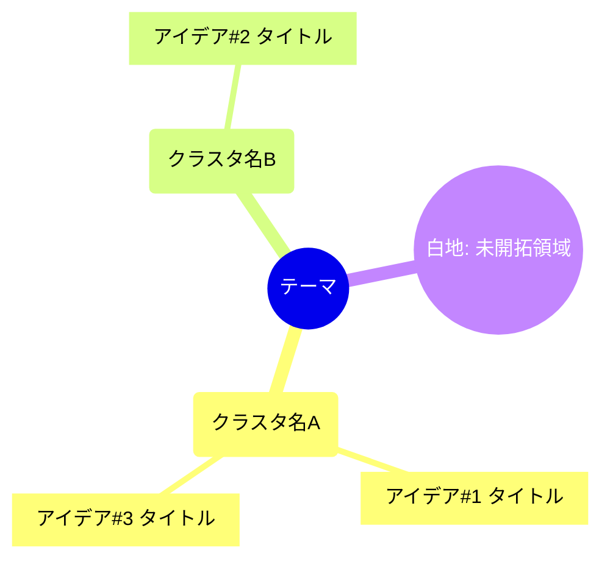

# シナリオ: ブレスト(brainstorm)

ユーザーが持ち込んだテーマに対し、価値観で分かれた3人格(MELCHIOR / BALTHASAR / CASPER)が
**それぞれのレンズで構造的に異なるアイデアを発散**し、ファシリテーターがアイデアマップに整理する。
これを数巡まわしたうえで、**各レンズでアイデアを評価**して上位案を選び、3レンズ協働で
ブラッシュアップする。アイデア集・アイデアマップ・評価マトリクス・上位案を成果物として残す。

> **このファイルの位置づけ**: `CLAUDE.md`(ルーター)が利用モードで本シナリオを選んだとき、
> ここに書かれたプロトコルに従う。役割・人格・LLMバックエンド・メディア/ファイル入力・召喚
> ルール・ファシリテーターの心得など**全シナリオ共通の作法は `CLAUDE.md`** にある。本ファイル
> はブレスト固有の「レンズ / 発散・収束モード / ラウンド構成 / 成果物」だけを定義する。
>
> **出力先**: `<root>/brainstorms/`(`<root>` は `local/` または `sharepoint/`。→ `CLAUDE.md`「SharePoint 連携」)

---

## このシナリオでの3人格(発散と評価のレンズ)

人格定義(`.claude/agents/*.md`)は合議と同一。価値観のレンズを**アイデアの発散と評価の両方に投影**して
使う。人格を専門家(企画者・コンサルタント)に作り変えるのではなく、価値観のレンズをそのまま ideation に
向ける(本プロジェクトの「価値観で分ける」原則を維持)。

| 人格 | 価値観レンズ | 発散の傾向 / 評価の重心 |
|---|---|---|
| **MELCHIOR**(科学者) | 論理・分析・客観性 | **発散**: 実現可能・仕組みで効く・体系的なアイデア(既存の仕組みの応用、効率化、検証できる施策)。**評価の重心**: 実現可能性、効果の確実性、リスク、コスト対効果 |
| **BALTHASAR**(母) | 共感・保護・関係性 | **発散**: 人・関係性を中心に置いた、持続可能で誰も取り残さないアイデア(受け手の感情・体験、長く続く仕組み)。**評価の重心**: 受容性、人への影響、持続可能性 |
| **CASPER**(個人) | 直感・欲求・自己実現 | **発散**: 大胆でワクワクする、独創的で常識を破るアイデア(尖り・遊び・意外性)。**評価の重心**: 訴求力、独創性、面白さ、挑戦の大きさ |

各人格の「意図的な弱み」は発散にも評価にも作用する(CASPER は非現実的な案を量産し、MELCHIOR は早すぎる
段階で創造性を切り捨て、BALTHASAR は破壊的な変化を避けがち)。**だからこそ3レンズで発散し、3レンズで
収束させ、互いの過剰・欠落を補正する**。1つのレンズだけでブレストすると、出るアイデアも評価も偏る。

発散を駆動するのは各レンズの**好奇心**(→ `CLAUDE.md`「3つの人格」/ 各 `.claude/agents/*.md`「好奇心・興味」)。
CASPER は新奇・体験へ、MELCHIOR は仕組み・因果へ、BALTHASAR は人・関係へ興味が向くため、3つの発散は
重ならず別の方向に広がる。興味が向きにくい領域(各人格の弱み)は他レンズが埋める。

## ブレストモード

テーマの重要度・広さに応じて選ぶ。Round 0でファシリテーターが提案、ユーザー指定があれば従う。

| モード | 含むラウンド | 用途 |
|---|---|---|
| **Quick** | 0, 1, 2, 4, 5, 6, 7, 8 | 短時間のネタ出し。発散1巡 → マップ → 評価 → 上位案ブラッシュアップ |
| **Standard** | 0, 1, 2, 3, 4, 5, 6, 7, 8 | 通常の企画。掛け合わせ1巡を加え、空白も埋める(既定) |
| **Deep** | 0, 1, 2, 3+ループ, 4, 5, 6, 6.5, 7, 8 | 重要な企画。発散ループ数巡 + プレモーテム + 深いブラッシュアップ |

迷ったら **Standard**。軽いネタ出しなら Quick、事業・重要施策の企画なら Deep。

**発散の回数はモードで決まる**: Quick=1巡(Round 1 のみ)/ Standard=2巡(Round 1 + 3)/ Deep=3巡以上
(Round 1 + 3 + 3-loop を数巡)。ただし**新しいアイデアが出尽くしたらファシリテーターが早めに収束へ移る**
(Round 4 へ)。ユーザーが毎回回数を指定する方式でも、無制限の動的ループでもない。

## ブレストプロトコル

### Round 0: テーマ整理(ファシリテーター)
- **(SharePoint 連携時)** `python scripts/sharepoint.py pull input` で参考資料を取得してから読む
  (→ `CLAUDE.md`「SharePoint 連携」)。無効時は不要。
- テーマを要約し**目的**を明確化(何のためのアイデア出しか。何が実現すれば成功か)
- **制約条件**を確認(予算・期間・対象・前提・外せない要件・やらないこと)
- **成功基準**を1〜2文で言語化(良いアイデアの条件)
- **評価軸を3〜6個確定**(Round 5のスコアリング用)。既定は3レンズの重心(例:実現可能性 / 受容性 /
  訴求力 / 独創性 / コスト)。ユーザーが軸を追加・限定可
- **発散ルールを宣言**(全員に課す):①判断は後回し(発散中は評価しない)②質より量 ③突飛なアイデア歓迎
  ④他者案に乗っかる・掛け合わせる(build-on)
- **ブレストモードを提案**(Quick / Standard / Deep)
- **成果物形式を確認**(アイデア集 Markdown + アイデアマップは既定。+ Excel / Word / マップ画像)

### Round 1: 発散① 独立アイデア出し(3人格並行)
- 全人格を並行召喚し、同じテーマ・制約・成功基準・発散ルールを渡す
- **他者のアイデアを見ず**、各レンズで独立に大量発散(量優先、磨き込み不要)
- 参考資料があれば全員に同じパスを渡す(→「このシナリオでのメディア/ファイル入力」)
- アイデア出力フォーマット(1件ごと):
  ```
  [人格] アイデア#N
  タイトル: <一言で伝わる名前>
  概要: <何をするか。1〜3文>
  狙い: <なぜ効くか / このレンズが推す理由>
  ```
- **与えられたテーマに沿って出す**(お題をすり替えない)。各人格は最低でも数件ずつ出す

### Round 2: アイデアマップ化(ファシリテーター)
- 全アイデアを**親和図 / マインドマップ**でクラスタ化し、**各クラスタに名前を付ける**
- **白地(まだ誰も触れていない未開拓領域)を明示**する(次の発散の的になる)
- この段階では**重複も残して可視化**する(まだ捨てない。収束は Round 4)
- マップは Mermaid mindmap で表現し、次ラウンドで全員に共有する(→「成果物」)

### Round 3: 発散② 掛け合わせ・空白埋め【Standard / Deep】
- マップと他人格のアイデアを全員に共有する
- 各人格は次のいずれかで新案を出す:**他者案に乗っかる(build-on)/ クラスタを横断して掛け合わせる /
  白地(未開拓領域)を攻める**
- フォーマットは Round 1 の `アイデア#N` に `派生元:` 行を加える(どの案・どのクラスタから派生したか)
- claude 人格間は `SendMessage` で直接やり取りする。**使えない実行環境では**ファシリテーターが各人格へ
  他者のアイデア・マップをダイジェスト/`--history` で渡して仲介する(→ `CLAUDE.md`「コンテキスト継続」)

### Round 3-loop: 発散ループ 追加巡【Deep】
- Round 3 を**数巡**繰り返す。各巡の前にファシリテーターが**マップを更新**(新クラスタ・白地を反映)し、
  次の build-on パスを促す
- **早期停止**: 目新しいアイデアが出なくなったら、上限を待たず Round 4 へ移る(上限の目安は2〜3巡)

### Round 4: 候補の絞り込み(ファシリテーター + 3人格)
- ファシリテーターが全アイデアを統合し**重複をマージ**、一覧化(アイデアIDを振る。統合元IDは残す)
- **明らかに成立しない案を理由付きで除外**(制約に抵触・テーマ外 等。理由を残す)
- 評価へ進める**ショートリストを合意**(5〜12件目安)。各人格は切られそうな案を**短く擁護できる**
- **尖った少数案を安易に切らない**(評価で割れる案ほど面白いことがある)

### Round 5: アイデア評価(3人格)
- ショートリストの各アイデアを、**全人格が Round 0 の評価軸で 0〜10 採点**し、一言根拠を付す
- 各人格はレンズの重心を保ったまま全軸を採点する(同じ案でもレンズで点が割れてよい)
- フォーマット(1アイデアごと):
  ```
  [人格] アイデア#N の評価
    - <軸1(例: 実現可能性)>: X/10 — <一言根拠>
    - <軸2(例: 受容性)>: X/10 — <一言根拠>
    - <軸3(例: 訴求力)>: X/10 — <一言根拠>
    - ...
  ```

### Round 6: 上位アイデアの選定(ファシリテーター)
- スコアを集計する。**単純平均で潰さず、レンズ別の内訳を保持**する(誰が推し、誰が引いたか)
- **上位 N 件**(3〜5件目安)を選定する
- **評価が割れた「尖り案」(スコアの分散が大きい案)を別枠で必ず浮上させる**。多数決で消さない
  (合議の「少数意見の保持」に相当)

### Round 6.5: プレモーテム(反証)【Deep、任意】
- 上位案をブラッシュアップする**前に**、各人格が失敗要因を先回りして突く(磨く前のストレステスト)
- フォーマット(1アイデアごと):
  ```
  [人格] アイデア#N へのプレモーテム
  想定される失敗: <何が起きると頓挫するか>
  弱点 / 前提リスク: <崩れると致命的な前提>
  ```

### Round 7: ブラッシュアップ(3人格)
- 上位案を**3レンズ協働**で強化する(CASPER=訴求・尖りを立てる / MELCHIOR=実現性・段取り・検証可能性 /
  BALTHASAR=人・受容・持続可能性)
- 各案で **具体化 / 弱点への対処(Round 6.5・評価で出た懸念の手当て)/ ネクストステップ** をまとめる
- フォーマット(上位案ごと):
  ```
  [上位案#N] <タイトル>
  磨き込み(CASPER 訴求 / MELCHIOR 実現 / BALTHASAR 人・持続):
    - ...
  対処した弱点: <出ていた懸念への手当て>
  ネクストステップ: <最初の一歩・検証方法>
  ```

### Round 8: 成果物生成(ファシリテーター)
- アイデアマップ + アイデア一覧 + 評価マトリクス + 上位案(ブラッシュアップ済み)+ ネクストアクションを生成
- Round 0で確認した形式で成果物を出力し、全ファイルパスをユーザーに提示
- **(SharePoint 連携時)** `python scripts/sharepoint.py push brainstorms` で成果物を遠隔へ反映し、
  ローカルパスと SharePoint URL(`sharepoint.py info <パス>`)の両方を提示する(→ `CLAUDE.md`)

## 発散を活発化させるためのファシリテーター指針

- **批判を後回しにする**: 発散フェーズ(Round 1〜3)では評価・否定をさせない。質より量を優先
- **発言量を確保する**: 各人格は各発散ラウンドで複数案を出す。沈黙させない
- **build-on を促す**: マップを見せ、`SendMessage` で他者案への乗っかり・掛け合わせを誘発する
- **収束を急ぎすぎない・引きずりすぎない**: 新案が出続ける間は発散を続け、出尽くしたら早めに Round 4 へ
- **レンズを薄めない**: 3人格を「無難な企画AI」に均さない。出るアイデアの色がレンズごとに違うのが妙味

## 召喚のヒント:レンズの当て方とステートレス文脈

全シナリオ共通の召喚ルールは `CLAUDE.md`「チームメイト召喚のルール」。本シナリオ固有の補足。

### レンズの当て方
- **人格定義(`.claude/agents/*.md`)は変えない**。発散・評価へ向けるのは召喚プロンプト側の役目。
  各人格には、上表「このシナリオでの3人格」の傾向・重心を**テーマに投影するよう**指示する(企画の
  専門家に作り変えない)。
- Round 1 の召喚プロンプトに最低限含めるもの:テーマ・制約・成功基準、発散ルール、レンズ別の傾向、
  出力フォーマット(`[人格] アイデア#N / タイトル / 概要 / 狙い`)。
- 各人格の「意図的な弱み」を一言添えると効く(例:CASPER には「実現性は今は気にせず尖らせてよい」、
  MELCHIOR には「発散中は実現性で切り捨てず量を出す」)。

### ステートレス人格への文脈の渡し方(ラウンド別)
openai / gemini 人格は呼び出しごとに記憶がリセットされる(→ `CLAUDE.md`「コンテキスト継続」)。
各ラウンドで最低限渡すべき文脈:

| ラウンド | その人格に毎回渡すもの |
|---|---|
| Round 1 | テーマ・制約・成功基準・発散ルール、レンズ別の傾向、出力フォーマット(`アイデア#N`) |
| Round 3 / 3-loop | 上記 + アイデアマップ(クラスタ・白地)+ 他人格のアイデアダイジェスト |
| Round 4 | (ファシリテーター主導)統合候補一覧 + 当該人格の主張 |
| Round 5 | ショートリスト全件 + Round 0 の評価軸(0〜10 採点指示) |
| Round 6.5 / 7 | 上位アイデア + そのスコア内訳 +(6.5 で出た)弱点リスト |

過去ラウンドは `--history`(その人格の過去発言は `assistant` ロール)で会話履歴として渡せる。
同じ参考資料を多ラウンド使うなら `upload` → `--file-id` の使い回しでトークンを節約。

## ファシリテーターの心得(このシナリオ固有)

- **発散と収束を混ぜない**。発散フェーズでは批判させず、評価は Round 5 にまとめる
- **尖りを守る**。評価が割れた案を単純平均で消さず、別枠で残す(平凡な最大公約数に均さない)
- **アイデア・スコアを捏造しない**。人格が出した案・採点だけを集計・記録する
- **build-on を系譜として残す**(`派生元`)。誰の案がどう育ったかを成果物に残す
- **全人格に同じテーマ・制約を等しく渡す**(レンズの差だけがアイデア・評価の差になるように)
- 各人格に「企画のプロのふり」をさせない。価値観レンズのままテーマに向かわせる

## 成果物

成果物は `<root>/brainstorms/` に出力する(`<root>` は `local/` または `sharepoint/`)。冒頭に
**どの人格がどの backend/model で動いたか**を明記する(再現性と公平性のため。→ `CLAUDE.md`
「人格ごとのLLMバックエンド選択」)。Word/Excel 生成には `pip install python-docx openpyxl`、
マップ画像には `matplotlib`(または graphviz)が必要。**SharePoint 連携時**は生成後に
`python scripts/sharepoint.py push brainstorms` で遠隔へ反映し、ローカルパスと SharePoint URL の
両方を提示する(→ `CLAUDE.md`「SharePoint 連携」)。

### アイデア集(Markdown、常に生成)
`<root>/brainstorms/YYYYMMDD-HHMM-<テーマ>.md`
- テーマ概要(目的 / 制約 / 成功基準 / 発散ルール)
- 使用人格と backend/model、評価軸
- **レンズ別の全アイデア一覧**(アイデアID・派生元付き)
- **アイデアマップ**(下記 Mermaid)
- **評価マトリクス**(アイデア × 評価軸 × 人格、平均と分散)
- **上位アイデア**(ブラッシュアップ済み)+ ネクストアクション
- **保持した「割れた尖り案」とその理由**(少数意見の保持)

### アイデアマップ(Mermaid mindmap、Markdown 埋め込み・常に生成)
依存ゼロで Markdown に埋め込む(多くのビューアでそのまま描画される):

````

````

各ノード末尾に発案レンズ記号 `(M)` / `(B)` / `(C)` を任意で添えると、どのレンズが何を広げたか追える。

### 任意: アイデア一覧 + 評価マトリクス(Excel)
`<root>/brainstorms/YYYYMMDD-HHMM-<テーマ>.xlsx`
- シート構成: Ideas(ID / タイトル / 概要 / 発案レンズ / 派生元)/ EvaluationMatrix(アイデア × 軸 ×
  人格スコア、平均・分散)/ TopIdeas(上位案とブラッシュアップ)/ SplitIdeas(割れた尖り案)
- 条件付き書式で高得点・高分散(割れ)を色分けすると見やすい

### 任意: 企画レポート(Word)
`<root>/brainstorms/YYYYMMDD-HHMM-<テーマ>.docx`
- 表紙 / テーマと制約 / アイデアマップ / レンズ別アイデア / 評価結果 / 上位案 / 割れた尖り案 /
  ネクストアクション / 付録(全アイデア)

### 任意: アイデアマップ画像(`<root>/media-output/`)
Mermaid をそのまま見られない共有先向けに、クラスタ図を画像化(matplotlib / graphviz)。

日本語フォント:
- macOS: `Hiragino Sans`
- Windows: `Yu Gothic` または `Meiryo`
- Linux: `Noto Sans CJK JP`

## このシナリオでのメディア/ファイル入力

ファイルの基本的な扱い(全 backend で同じファイルを等しく渡す、Office はローカル抽出、多ラウンドは
`upload`→`file-id` 使い回し等)は `CLAUDE.md`「メディア入力の扱い」を参照。ブレストでは:

1. 参考資料(既存案・データ・競合資料・ラフ画像など)は `<root>/input/` に置くか、パスを直接指定する
   (SharePoint 連携時は `sharepoint.py pull input` で取得。→ `CLAUDE.md`「SharePoint 連携」)
2. テーマに関わる資料なら、各人格の召喚プロンプトに**同じパス**を含める(対称性の確保)
3. テーマと無関係なファイルは無視する
4. 各人格は同じ資料を独立に見て、人格に基づく着想を得る(同じ資料でも科学者の目・母の目・個の目で
   広がるアイデアが違うのがブレストの妙味)
5. openai / gemini 人格には `--file <資料パス>` で渡す(docx/pdf/xlsx/pptx も抽出して渡る)。多ラウンドで
   同じ資料を使うなら一度 `upload` して `--file-id` を使い回すとトークンを節約できる
